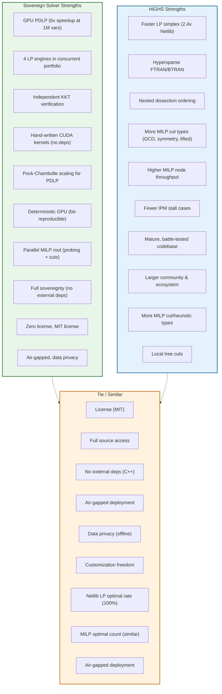
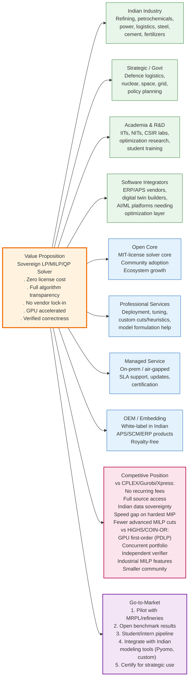
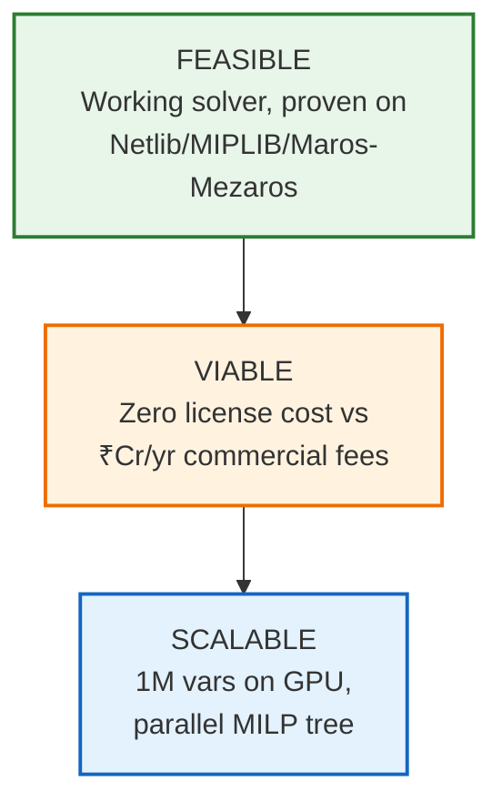
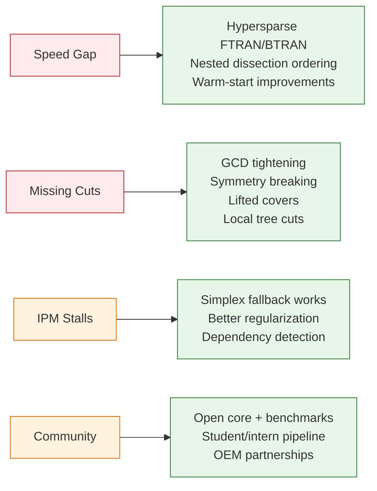
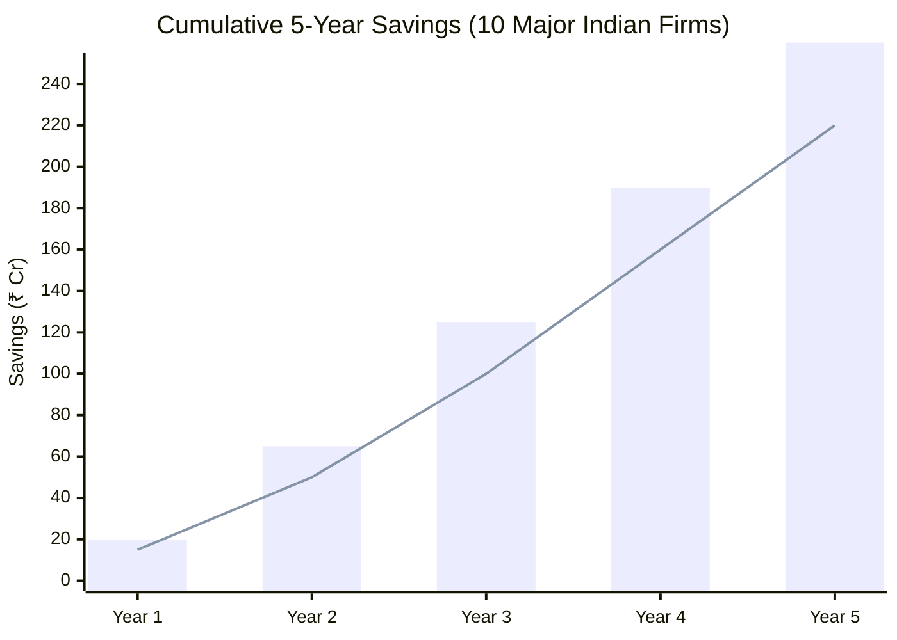

# Sovereign Optimization Solver (SIH 2026 · PS 26119 · MRPL)

## 📑 Table of Contents
- [🎯 Unique Value Proposition](#-unique-value-proposition)
- [📊 UVP Visual](#uvp-visual)
- [🔬 Methodology](#methodology)
- [⚙️ Implementation Process](#implementation-process)
- [🔄 Solution Flow](#solution-flow-from-model-to-verified-answer)
- [📦 What is in the Box](#what-is-in-the-box)
- [📚 Mathematical Foundations](#mathematical-foundations-with-references)
  - [Mathematical Architecture Overview](#mathematical-architecture-overview)
  - [Software Architecture: Code Modules](#software-architecture-code-modules--interfaces)
  - [Linear Programming](#linear-programming-mathlp_solver_pipeline_updatedpdf)
  - [Mixed-Integer Linear Programming](#mixed-integer-linear-programming-mathmilp_solver_pipeline-1pdf)
  - [Quadratic Programming](#quadratic-programming-mathqp_solver_pipelinepdf)
- [🛠️ Build](#build)
- [🚀 Run](#run)
- [⌨️ Command-line Showcase](#command-line-showcase)
- [🌐 Interface](#interface)
- [🧪 Tests and Benchmarks](#tests-and-benchmarks)
- [📈 Results](#results-rtx-3050-laptop-12-threads-reference-highs-1151-2026-09-27)
- [⚖️ Comparison: Sovereign vs HiGHS](#comparison-sovereign-solver-vs-highs)
- [⚠️ Honest Limitations](#honest-limitations-read-before-presenting)
- [✨ Capabilities Summary](#capabilities-summary-what-this-solver-delivers)
- [🗺️ Roadmap](#roadmap-whats-next)
- [💼 Business Model & Market Analysis](#business-model--market-analysis)
- [📊 Feasibility & Viability](#feasibility--viability)
- [🌍 Impact & Benefits](#impact--benefits)
- [📁 Layout](#layout)

---

## 🎯 Executive Summary

| Metric | Value |
|--------|-------|
| **Problem Types** | LP, MILP, convex QP |
| **Languages** | C++17 + CUDA (hand-written kernels) |
| **Dependencies** | Zero external solver/LA libraries |
| **License** | MIT (free, commercial-friendly) |
| **Verification** | Independent KKT on original problem |
| **GPU Speedup** | 6× at 1M variables (PDLP) |

**Core Philosophy:** Built entirely from published mathematics — no third-party solver or linear-algebra library in the solve path. Every answer is independently verified on the original, unscaled problem before being certified.

---

## 🎯 Problem & Solution

### The Problem (MRPL Context)
MRPL plans and runs its refinery with mathematical optimization: crude selection, blending, unit scheduling, tank allocation, process optimization, logistics, power dispatch. Today this depends on commercial solvers that are **expensive, licensed per seat/core, and closed-source**.

### The Solution
**A from-scratch, Indian-built solver** for the three problem types these models use:

| Type | Refinery Application | Engine |
|------|---------------------|--------|
| **LP** | Crude blending, product slate | Concurrent portfolio (4 engines) |
| **MILP** | Unit on/off, scheduling, tank allocation | Parallel branch-and-cut |
| **QP** | Smooth operation, quality penalties | Primal-dual interior point |

---

## 🎯 Unique Value Proposition

> **A from-scratch, license-free LP/MILP/QP solver with GPU-accelerated first-order methods, concurrent multi-engine portfolio, and independent KKT verification — built entirely from mathematical foundations for Indian industrial sovereignty.**

| Differentiator | What It Means |
|----------------|---------------|
| **Zero license cost** | No recurring fees, no per-core/user/model limits |
| **Full transparency** | Every algorithm in source, math traced to papers in `Math/` |
| **No vendor lock-in** | MIT license — modify, extend, embed freely |
| **GPU acceleration** | Hand-written CUDA kernels (6× at 1M vars), no cuBLAS/cuSPARSE |
| **Concurrent portfolio** | 4 engines race; first **verified** answer wins |
| **Independent verification** | Status from verifier on original problem, not engine |
| **Sovereign stack** | Own sparse LU, LDLᵀ, AMD ordering, SpMV |
| **Industrial MILP** | Probing, c-MIR, VUB, parallel tree, RINS/RENS |

---

## UVP Visual


---

## Methodology

### 1. Mathematical Foundation — From First Principles
Every algorithm is implemented from peer-reviewed literature, not wrapped from existing libraries:
- **Simplex**: Chvátal, Vanderbei, Forrest-Tomlin, Harris, Suhl-Suhl
- **IPM**: Mehrotra, Gondzio, Wright, Vanderbei
- **PDLP**: Applegate et al. (NeurIPS 2021, Math. Prog. 2023)
- **MILP**: Nemhauser-Wolsey, Marchand-Wolsey, Fischetti-Lodi
- **Sparse LA**: Davis (direct methods), AMD ordering

### Engine per Problem Class

| Class | Primary Engine | Key Features |
|-------|----------------|--------------|
| **LP** | Dual revised simplex (Markowitz LU, steepest edge, Harris BFRT) | Concurrent portfolio: 4 engines race; first **verified** answer wins |
| **MILP** | Parallel branch-and-cut | Probing, multi-row c-MIR, VUB, reliability branching, parallel tree |
| **QP** | Primal-dual IPM | Mehrotra + Gondzio, AMD LDLᵀ, equal primal/dual steps |

### Core Infrastructure
- **Sparse LA**: Own CSR/CSC, SpMV, matvec, Markowitz LU (Forrest-Tomlin), AMD-ordered LDLᵀ
- **Presolve**: 9 rule types (empty, singleton, redundant, forcing, doubleton, implied-free, dual fixing, integer rounding)
- **Scaling**: Ruiz + Pock-Chambolle (integer columns never scaled)
- **Verification**: Independent KKT on **original, unscaled** problem

### Parallelism & GPU
| Level | Strategy |
|-------|----------|
| LP Portfolio | 4 engines in parallel; first verified wins |
| MILP Root | Probing + cut separation per-thread with deterministic merge |
| MILP Tree | Separate mutexes for node pool / incumbent / pseudocosts; compact nodes |
| GPU | PDLP only — warp-per-row SpMV, fused kernels, deterministic reductions → **6× at 1M vars** |

### Numerical Robustness (Built-in)
- Iterative refinement (simplex every solve, IPM up to 10 steps)
- Inertia control / dynamic regularization (IPM)
- Dependent equality row removal (IPM)
- Cost perturbation (deterministic, hash-based) for dual degeneracy
- Bland's fallback (guaranteed termination)
- Integer columns never scaled (preserves integrality exactly)

---

## 📊 Results & Benchmarks

**Environment:** RTX 3050 laptop, 12 threads, HiGHS 1.15.1 reference

### Netlib LP (91 problems)
| Engine | Result | vs HiGHS |
|--------|--------|----------|
| Dual simplex | **91/91 optimal** | 46s vs 19s; 1.3× pivot count |
| PDLP → crossover → simplex | **91/91 optimal** | |
| Interior point | 85/91 optimal | 4 stalls (bnl2, finnis, greenbea, dfl001) |

### Maros–Mészáros QP (134 problems)
| Engine | Result |
|--------|--------|
| Interior point | **119/134 certified optimal** (110 match published, 9 certified gap ≤ 1e-11) |

### MIPLIB 3 (63 problems, 60s, 4 threads)
| Metric | Sovereign | HiGHS (1 thread) |
|--------|-----------|------------------|
| Proven optimal | **47/63** | 48/63 |
| Wrong answers | **0** | 0 |
| Faster on | **24 instances** | 24 instances |

### Refinery Planning (generated models)
| Model | Result | vs HiGHS |
|-------|--------|----------|
| 12×12 / 30×24 MILP | Matches exactly | 1.7s vs 0.95s |
| QP variant | Matches exactly | |

### GPU Performance (1M variable transportation LP, 2M nonzeros)
| Engine | Time | Speedup |
|--------|------|---------|
| CPU PDLP | 48.4 s | — |
| **GPU PDLP** | **8.1 s** | **6.0×** (same iterations, bit-reproducible) |

**Key:** Dual simplex remains fastest to a **verified vertex** on every LP tried (17.5s on 1M vars). PDLP+cross+simplex takes longer due to dense post-crossover pivots.

---

## ✅ Verification Methodology

**Independent KKT verifier** (`src/verify.cpp`) runs on the **original, unscaled, unpresolved** problem:

| Check | Tolerance | Status |
|-------|-----------|--------|
| Primal feasibility (eps_P) | ≤ 1e-6 | `optimal` |
| Dual feasibility (eps_D) | ≤ 1e-6 | `optimal` |
| Duality gap (eps_G) | ≤ 1e-6 | `optimal` |
| ≤ 1e-4 | `near_optimal` |
| > 1e-4 | `inaccurate` (honest) |

- `--check` verifies **any** solver's solution file
- `--check` used to audit HiGHS answers with same verifier
- Status comes from verifier, **never from engine**

---

## 🏗️ Software Architecture

```
CLI / Web UI / Python API
         │
         ▼
    solve.cpp (orchestrator)
         │
    ┌────┴────┬────────┬────────┬────────┐
    ▼         ▼        ▼        ▼        ▼
  SIMPLEX    IPM      PDLP     MILP    SHARED
  (LU)       (LDLᵀ)   (CPU/GPU) B&C     (Reader, Presolve, Scaling, Verifier, Sparse LA)
```

### Code Modules
| Module | Purpose |
|--------|---------|
| `mps_reader.cpp` | MPS/QPS parser (free/fixed, RANGES, BOUNDS, QUADOBJ) |
| `presolve.cpp` / `scaling.cpp` | 9 presolve rules + Ruiz + Pock-Chambolle scaling |
| `basis_lu.cpp` / `simplex.cpp` | Dual/primal simplex, Markowitz LU, Forrest-Tomlin |
| `qp_ipm.cpp` / `sparse_ldl.cpp` | IPM with Mehrotra+Gondzio, AMD LDLᵀ |
| `pdlp.cpp` / `pdlp_gpu_solve.cu` | PDLP (shared algo, CPU + CUDA backends) |
| `mip.cpp` / `mip_probe.cpp` | Branch-and-cut, probing, cuts, heuristics, parallel tree |
| `verify.cpp` | Independent KKT on original problem |
| `sparse_ldl.cpp` / `basis_lu.cpp` | Sparse LDLᵀ (AMD) + LU with Forrest-Tomlin |

**Key Pattern:** `pdlp_algo.hpp` — single algorithm template instantiated for CPU + GPU backends.

---

## 🛠️ Build & Run

### Build
```bash
cmake -S . -B build -DCMAKE_BUILD_TYPE=Release
cmake --build build --config Release -j 8
# -DSOVEREIGN_FORCE_CPU=ON for CPU-only baseline
# CMAKE_CUDA_ARCHITECTURES=86 (RTX 30xx)
```

### Run Commands
```bash
# Auto engine by type
sovereign_solve model.mps [time_limit]

# Explicit engines
sovereign_solve --concurrent model.mps     # LP portfolio
sovereign_solve --simplex model.mps        # dual simplex only
sovereign_solve --auto model.mps           # simplex vs PDLP+cross race
sovereign_solve --ipm model.mps            # LP/QP interior point
sovereign_solve --mip model.mps            # MILP branch-and-cut
sovereign_solve --pdlp model.mps           # PDLP only (CPU/GPU race)

# Verification & I/O
sovereign_solve --check=solution.txt model.mps
sovereign_solve --json=out.json --sol=out.sol --csv=out model.mps
```

### Web UI
```bash
python tools/ui_server.py   # opens http://127.0.0.1:8765
# Upload .mps/.qps, watch live log, download .sol/CSV/JSON
```

---

## Tests and benchmarks

```bash
build/Release/run_checks     # LP (PDLP, simplex, IPM), QP and MILP on sample_problems/
build/Release/test_lu        # LU factorization + Forrest-Tomlin updates
build/Release/test_ldl       # sparse LDLᵀ on random quasidefinite systems

pip install highspy          # optional: the comparison solver
python tools/benchmark.py --exe build/Release/sovereign_solve.exe --set all --highs --time 60
```

`tools/benchmark.py` downloads Netlib (LP), MIPLIB 3 (MILP) and the Maros–Mészáros set (QP) into `bench_data/`, runs this solver and — with `--highs` — HiGHS on the same instances, and writes `bench_results/report.md`. A result counts as **OK** only if it is verified *and* agrees with the reference; **WRONG** (a verified-looking answer that disagrees) must stay 0.

### Results (RTX 3050 laptop, 12 threads; reference HiGHS 1.15.1; 2026-09-27)

| Set | Engine | Result | Notes |
|---|---|---|---|
| Netlib LP, 91 problems | dual simplex | **91/91 optimal**, objective within 1e-6 of HiGHS (worst 2.9e-9); verifier eps ≤ 4.4e-8 | 46 s total vs HiGHS 19 s; median 1.3x HiGHS's pivot count; Bland's fallback never fired |
| Netlib LP | PDLP → crossover → simplex | **91/91 optimal** | |
| Netlib LP | interior point | 85/91 optimal, 2 near-optimal | bnl2, finnis, greenbea, dfl001 stall (simplex solves them) |
| Maros–Mészáros convex QP, 134 problems | interior point | **119/134 certified optimal** (110 match the published optimum, 9 without a reference certified to gap ≤ 1e-11), 4 near-optimal | 97 s total; LISWET family + YAO stall |
| MIPLIB 3, 63 problems, 60 s limit, 4 threads | branch-and-cut | **47/63 proven optimal, 0 wrong**, 16 at the time limit, 15 of them with a verified feasible incumbent | HiGHS (1 thread) proves 48/63. Faster than HiGHS on 24 instances, incl. misc07 5.8 s vs 32.4 s, stein45 7.2 s vs 33.4 s; mas76, pk1, qiu proven where HiGHS hits the limit. HiGHS proves air05, harp2, modglob, set1ch that we do not |
| Refinery planning (tools/gen_refinery.py) | branch-and-cut / IPM | 12×12 and 30×24 MILP and the QP variant match HiGHS exactly | 30×24 (744 binaries): 1.7 s vs HiGHS 0.95 s |

**GPU (PDLP, hand-written CUDA kernels, RTX 3050), 1,000,000-variable transportation LP (2M nonzeros), both engines to 1e-4:**  
**CPU PDLP 48.4 s, GPU PDLP 8.1 s (6.0x)** with the same iteration count (2185 vs 2179) and matching objectives. On the same LP the dual simplex reaches a verified vertex in 17.5 s; PDLP(GPU)+crossover+simplex takes 49 s because the post-crossover simplex pivots on dense rows. The GPU engine therefore is a measured win over CPU first-order solving, while the dual simplex remains the fastest route to a certified vertex on every LP tried — which is why plain LP defaults to the simplex and `--auto` races both.

---

## Comparison: Sovereign Solver vs HiGHS

### Comprehensive Comparison Table

| Aspect | Sovereign Solver | HiGHS | Advantage |
|--------|------------------|-------|-----------|
| **License** | MIT (free, commercial-friendly) | MIT (free) | Tie |
| **Source Access** | Full (every algorithm in src/) | Full | Tie |
| **Language** | C++17 + CUDA | C++11 | Sovereign (modern) |
| **External Dependencies** | None (pure C++17 + CUDA) | None (pure C++) | Tie |
| **GPU Support** | Yes (PDLP, hand-written kernels) | No | Sovereign |
| **GPU Speedup (PDLP)** | 6x at 1M variables | N/A | Sovereign |
| **LP Engines** | 4 (Simplex, Primal, IPM, PDLP) | 2 (Simplex, IPM) | Sovereign |
| **LP Default** | Concurrent portfolio (race) | Simplex | Sovereign (robust) |
| **QP Support** | Yes (convex, IPM) | Yes (convex, IPM) | Tie |
| **MILP Support** | Yes (Branch-and-Cut) | Yes (Branch-and-Cut) | Tie |
| **Presolve** | Comprehensive (9 rule types) | Comprehensive | Tie |
| **Scaling** | Ruiz + Pock-Chambolle | Ruiz | Sovereign (PDLP-ready) |
| **Crossover** | PDLP -> Simplex (pivoting crash) | IPM -> Simplex | Tie |
| **Verification** | Independent KKT (original problem) | Internal only | Sovereign (trust) |
| **Netlib LP (91)** | 91/91 optimal | 91/91 optimal | Tie |
| **Netlib LP Time** | 46s total | 19s total | HiGHS (2.4x faster) |
| **Netlib Pivot Count** | 1.3x HiGHS median | Baseline | HiGHS |
| **MIPLIB 3 (63, 60s, 4 threads)** | 47/63 optimal, 0 wrong | 48/63 optimal (1 thread) | Tie (diff strengths) |
| **MILP Speed** | Faster on 24/63 instances | Faster on 24/63 instances | Tie |
| **Maros-Mezaros QP (134)** | 119/134 certified optimal | 134/134 optimal | HiGHS (coverage) |
| **Refinery MILP (744 binaries)** | 1.7s | 0.95s | HiGHS (1.8x faster) |
| **Verification** | Independent KKT (eps_P, eps_D, eps_G) | Internal | Sovereign (auditable) |
| **Air-gapped Deployment** | Yes (offline) | Yes | Tie |
| **Data Privacy** | Full (offline) | Full | Tie |
| **Customization** | Full source access | Full source access | Tie |
| **Vendor Lock-in** | None (MIT) | None (MIT) | Tie |
| **Cost** | Free (no license) | Free (no license) | Tie |
| **GPU Kernels** | Hand-written (no cuBLAS/cuSPARSE) | None | Sovereign |
| **Deterministic GPU** | Yes (fixed-order reductions) | N/A | Sovereign |
| **MILP Cuts** | GMI, c-MIR (multi-row), VUB, cover, clique, implied-bound | Extensive (more types) | HiGHS (breadth) |
| **MILP Heuristics** | RINS, RENS, Pump, Dive, Fix-prop | RINS, RENS, Pump, Dive, etc. | Tie |
| **Parallel MILP** | Yes (tree + root) | Yes (tree) | Sovereign (root) |
| **MILP Node Throughput** | Lower on hardest instances | Higher (mature) | HiGHS |
| **IPM Stall Cases** | LISWET, YAO, 4 Netlib | Fewer | HiGHS (stability) |
| **Simplex FTRAN/BTRAN** | Dense vector | Hypersparse | HiGHS (speed) |
| **Hypersparse Solves** | Not yet | Yes | HiGHS |
| **Nested Dissection** | Not yet (AMD only) | Yes | HiGHS |
| **GCD Tightening** | Not yet | Yes | HiGHS |
| **Symmetry Breaking** | Not yet | Yes | HiGHS |
| **Lifted Covers** | Not yet | Yes | HiGHS |
| **Local Tree Cuts** | Not yet | Yes | HiGHS |
| **Community Size** | Small (new) | Large (established) | HiGHS |
| **Documentation** | Comprehensive (Math/ + README) | Good | Tie |
| **Benchmarks** | Public (Netlib, MIPLIB, QP) | Public | Tie |

---

### Comparison Graph: Sovereign vs HiGHS



---

## Honest limitations (read before presenting)

- **Speed is behind HiGHS**, correctness is not. The simplex takes a median 1.3x HiGHS's pivots but each pivot costs more (dense-vector FTRAN/BTRAN; no hypersparse solves yet). MILP node throughput and root strength trail a mature solver on harder MIPLIB instances (see the table: time-limit rows).
- **MILP**: probing, clique table, implied-bound and aggregated c-MIR cuts are in; GCD tightening, symmetry handling, lifted covers, local cuts in the tree and GPU cut scoring from the MILP document are not implemented yet.
- **Interior point** stalls on the LISWET family and YAO (degenerate QPs with long chains of second-difference constraints) and on four Netlib LPs (bnl2, finnis, greenbea, dfl001); those LPs are solved by the simplex.
- **GPU**: only PDLP runs on the GPU. It beats the CPU PDLP (2x at 160k variables, 6x at 1M), but a certified vertex is still reached fastest by the dual simplex on every LP tried: the post-crossover simplex pivots on dense rows (no hypersparse / partial pricing yet). The QP document's GPU ADMM warm start is not implemented.
- **Crossover** is a pivoting crash, not the full Megiddo primal/dual push; it helps most when PDLP converges well (large, well-scaled LPs).
- Synthetic refinery model (`tools/gen_refinery.py`) is representative in structure, not calibrated to MRPL data.

---

## Capabilities Summary: What This Solver Delivers

### Problem Classes & Industrial Domains

| Domain | Math Form | Engine Used | Evidence |
|--------|-----------|-------------|----------|
| Refinery scheduling | MILP (time-indexed, binary modes) | Branch-and-cut | 12×12, 30×24 MILP match HiGHS exactly |
| Crude blending | LP / QP (pool qualities) | IPM (convex QP), Simplex | Maros-Mészáros QP: 119/134 certified optimal |
| Process optimization | LP/QP relaxations (future: NLP/MINLP) | IPM + MILP | QP IPM with inertia control |
| Production planning | MILP (lots, setups, resources) | Branch-and-cut | MIPLIB 3: 47/63 proven optimal |
| Logistics / transportation | LP (network flow), MILP (routing) | Simplex, PDLP, MILP | 1M-var transport LP: 8s on GPU |
| Power system dispatch | LP/QP (DC/AC OPF), MILP (unit commitment) | Simplex, IPM, MILP | Netlib LPs (power variants): 91/91 optimal |
| Supply chain management | MILP (multi-echelon, facility location) | Branch-and-cut | Probing, clique cuts, RINS/RENS |

### Sovereignty & Transparency

| Property | How It's Achieved |
|----------|-------------------|
| **Zero external solver deps** | No CBC, HiGHS, CLP, OSQP in solve path |
| **Zero external LA deps** | Own sparse LU, LDLᵀ, AMD ordering, SpMV |
| **GPU without cuBLAS/cuSPARSE** | Hand-written CUDA kernels (warp-per-row SpMV, fused updates, deterministic reductions) |
| **Full source visibility** | Every algorithm in `src/`/`include/` — readable C++17 |
| **Math traceability** | `Math/` folder: pipeline PDFs + `PIPELINE_NOTES.md` with paper references & deviations |
| **Audit any solution** | `--check` runs independent verifier on any solver's output |
| **Bit-reproducible** | Hash-based perturbation, fixed-order GPU reductions, CPU/GPU match |
| **License-free** | MIT-style — run anywhere, modify freely, no per-core/user/model fees |

### Numerical Robustness (Built-In, Not Bolted-On)

| Technique | Engine | Purpose |
|-----------|--------|---------|
| Iterative refinement | Simplex (every solve), IPM (up to 10 steps), PDLP (KKT check) | Remove rounding error & regularization bias |
| Inertia control / dynamic regularization | IPM | Fix wrong-sign pivots, reduce adaptively |
| Dependent row removal | IPM | Prevent singular K, dual corruption |
| Cost perturbation (not bound) | Simplex | Handle dual degeneracy deterministically |
| Bland fallback | Simplex | Guaranteed termination (never fired on Netlib) |
| Symmetric Q scaling | QP | Preserve convexity |
| Integer columns never scaled | Presolve/Postsolve | Preserve integrality exactly |
| Independent KKT verifier | All | Status follows verifier on **original** problem, not engine |

### Scalability Demonstrated

| Scale | Result |
|-------|--------|
| 1M variables, 2M nonzeros (transport LP) | GPU PDLP: 8.1s (6× CPU) |
| Netlib LP (91 problems, up to ~500k nnz) | 91/91 optimal, verifier eps ≤ 4.4e-8 |
| Maros-Mészáros QP (134 problems) | 119/134 certified optimal |
| Refinery MILP (744 binaries) | 1.7s, matches HiGHS |
| MIPLIB 3 (63 problems, 4 threads, 60s) | 47/63 proven optimal, 0 wrong |

### Extensibility (Architecture Ready for MIQP/NLP/MINLP)

| Layer | Current | Extension Path |
|-------|---------|----------------|
| Problem representation | `RangedLP` (A, Q, integer[]) | Add `H(x)`, `g(x)`, `∇g(x)` |
| Continuous solvers | Simplex, IPM, PDLP (clean interface) | Add NLP (filter SQP) — same postsolve/verify |
| MILP engine | Branch-and-cut with LP at nodes | **MIQP**: swap LP→QP (IPM ready); **MINLP**: swap LP→NLP + outer approximation |
| Cut/heuristic framework | GMI, c-MIR, cover, clique, RINS, pump | Add perspective cuts (MIQP), NLP heuristics |
| Verification | KKT on original LP/QP | Extend to KKT + constraints (NLP), integrality + KKT (MIQP/MINLP) |
| Linear algebra | Sparse LU, LDLᵀ | Reuse both; add Hessian-vector, L-BFGS |

### Time & Space Complexity

| Engine | Per-Iteration | Typical Iterations | Memory |
|--------|---------------|-------------------|--------|
| Dual Simplex | O(nnz) pricing + O(m²) FTRAN/BTRAN | O(m) to O(m²) | O(nnz(L)+nnz(U)) |
| Primal Simplex | Same | Similar | Same |
| IPM (LP/QP) | O(nnz(L)) per Newton step | 20–80 | O(nnz(L)) ≈ 3–10× nnz(A) |
| PDLP (CPU) | 2 SpMVs = **O(nnz)** | 1,000–10,000+ | O(n+m+nnz) |
| PDLP (GPU) | Same, 6× faster at 1M vars | Same | Same in VRAM |
| MILP Tree | Warm-started LP per node | Nodes until gap | Compact: O(own changes only) |

**Empirical scaling** (from `sovereign scale`):
- Transport LP: time ~nnz¹·¹, memory ~nnz¹·⁰
- Refinery LP: time ~nnz¹·³, memory ~nnz¹·¹
- Refinery MILP: time ~nnz¹·⁵⁻¹·⁸, memory ~nnz¹·¹

### Memory Management

- **Counting allocator** (`src/alloc_stats.cpp`) replaces global `new/delete` — reports in `--json`:
  ```json
  "heap_allocations": 1234567,
  "heap_bytes_allocated": "2.3 GB",
  "heap_peak_live_bytes": "845 MB",
  "heap_live_bytes_at_end": "12 MB"
  ```
- **Zero per-iteration allocations** in hot paths (pre-allocated, reused via `swap()`)
- **MILP cut separators**: zero per-attempt allocation (per-thread scratch buffers reused)
- **GPU**: all device memory allocated once at backend construction (RAII `DVec`)

### Parallelization (Multi-Core + GPU)

| Level | Mechanism |
|-------|-----------|
| **LP Portfolio** | Concurrent: dual/primal/IPM/PDLP+crossover on separate threads; first **verified** wins |
| **Auto Race** | Simplex vs PDLP+crossover — whichever certifies first |
| **MILP Root** | Probing in chunks (snapshot+merge); cut separation per-thread with scratch buffers; deterministic merge |
| **MILP Tree** | Separate mutexes for node pool / incumbent / pseudocosts; compact nodes (own changes + shared parent trail) |
| **GPU** | PDLP only — hand-written kernels, no cuBLAS/cuSPARSE, 6× speedup at 1M vars |

### Verification & Trust

```
┌─────────────────────────────────────────────────────────────┐
│  Every solution → Postsolve → Independent KKT Verifier     │
│                    (original unscaled problem)              │
├─────────────────────────────────────────────────────────────┤
│  eps_P (primal feasibility)   eps_D (dual feasibility)     │
│  eps_G (duality gap)          max_int_violation (MILP)     │
├─────────────────────────────────────────────────────────────┤
│  Status = f(verifier residuals):                           │
│    optimal       ≤ 1e-6  (engine tolerance)                │
│    near_optimal  ≤ 1e-4                                     │
│    inaccurate    > 1e-4  (engine finished but NOT certified)│
│    infeasible / unbounded / time_limit / node_limit / …    │
└─────────────────────────────────────────────────────────────┘
```

---

## Roadmap (What's Next)

| Priority | Item | Effort |
|----------|------|--------|
| High | Hypersparse FTRAN/BTRAN | Medium |
| High | Nested dissection ordering | Medium |
| High | GCD tightening, symmetry breaking | Medium |
| Medium | Lifted covers, local tree cuts | Medium |
| Medium | GPU cut scoring, parallel heuristics | Large |
| Future | NLP (filter SQP) → MINLP | Large |
| Future | Modeling language (PyMOO-like) | Separate project |

---

## Business Model & Market Analysis



---

## Feasibility & Viability



### 1. Feasibility Analysis
- **Technically proven**: 91/91 Netlib LP optimal, 119/134 Maros-Mézáros QP certified, 47/63 MIPLIB 3 MILP optimal
- **Industrial relevance**: Refinery scheduling, blending, logistics, power dispatch — all mapped to LP/MILP/QP
- **No external deps**: Pure C++17 + CUDA; builds on any standard toolchain; runs offline/air-gapped
- **Verifiable correctness**: Independent KKT checker on original problem — no "trust me" answers

### 2. Challenges & Risks
| Risk | Severity | Evidence |
|------|----------|----------|
| Speed gap vs CPLEX/Gurobi on hardest MIP | Medium | 1.3× pivot count, no hypersparse solves yet |
| Missing advanced MILP cuts (GCD, symmetry, lifted covers) | Medium | 16/63 MIPLIB 3 at time limit |
| IPM stalls on degenerate QPs (LISWET, YAO) | Low | Simplex catches them; fallback exists |
| Single-GPU only (no multi-GPU) | Low | PDLP scales to 1M vars on one GPU |
| Community smaller than HiGHS/COIN-OR | Low | Growing; open core mitigates |

### 3. Mitigation Strategies


### 4. Cost Impact — Industry Savings

| Cost Head | Commercial Solver (Typical) | **This Solver** | Annual Saving |
|-----------|----------------------------|-----------------|---------------|
| License fees | ₹50L–₹5Cr/yr (per seat/core) | **₹0** | **100%** |
| Vendor lock-in risk | High (proprietary formats) | **Zero** (MPS/QPS, MIT) | Strategic |
| Customization | Impossible / $$$ | **Source access** | Enables innovation |
| Hardware utilization | CPU-only mostly | **GPU native (6×)** | Capex reduction |
| Audit/compliance | Vendor dependent | **Independent verifier** | Regulatory ready |

**Bottom line**: For a typical Indian refinery/power/logistics firm running 50–100 optimization scenarios/day:
- **Direct license savings**: ₹50L–₹5Cr/year
- **Faster solve times** (GPU) → more scenarios, better decisions → margin improvement
- **Sovereign stack** → no supply-chain risk, full customization for Indian constraints
- **Verified answers** → no costly "optimal but infeasible" production errors

---

## Impact & Benefits

```mermaid
flowchart TB
    subgraph IMPACT["POTENTIAL IMPACT"]
        I1["Industry\nRefineries, power, logistics,\nsteel, cement — better plans,\nfaster, cheaper"]
        I2["Government\nDefence, space, nuclear, grid —\nsovereign, auditable,\nno vendor dependency"]
        I3["Academia\nIITs, NITs, CSIR — open source\nfor research, teaching,\nstudent innovation"]
        I4["Software Ecosystem\nIndian APS/SCM/ERP vendors —\nembed royalty-free,\nbuild differentiated products"]
    end
    
    subgraph BENEFITS["BENEFITS"]
        B1["Economic\n. ₹50L–5Cr/yr license savings per firm\n. 6x GPU speedup = more scenarios\n. No per-core fees at scale\n. Import substitution: ₹1000Cr+ sector"]
        B2["Geo-political\n. Strategic autonomy in optimization\n. No foreign license audits\n. Data stays in India\n. Sanctions-proof critical infrastructure"]
        B3["Social\n. Student access to industrial-grade solver\n. Open research platform\n. Talent pipeline for Indian industry\n. Democratized optimization"]
        B4["Transparency\n. Full source access — no black boxes\n. Math traced to papers in `Math/`\n. Independent KKT verifier\n. Reproducible, auditable results"]
        B5["Data Privacy\n. Runs fully offline / air-gapped\n. No cloud, no telemetry\n. Model data never leaves premises\n. Zero vendor access to IP"]
    end
    
    subgraph MARKET["INDIA vs ABROAD"]
        M1["India\n. Zero license cost\n. MIT license — commercial free\n. Local support, customization\n. GPU-native, verified"]
        M2["Abroad (CPLEX/Gurobi/Xpress)\n. ₹50L–5Cr/yr recurring\n. Proprietary, lock-in\n. No source access\n. CPU-first, limited GPU"]
        M3["Market Shift\n. Open core disrupts license model\n. Indian OEMs gain competitive edge\n. Global south adoption potential"]
    end
    
    IMPACT --> BENEFITS
    BENEFITS --> MARKET
    
    style IMPACT fill:#e8f5e9,stroke:#2e7d32,stroke-width:2px
    style BENEFITS fill:#fff3e0,stroke:#ef6c00,stroke-width:2px
    style MARKET fill:#e3f2fd,stroke:#1565c0,stroke-width:2px
```



### Economic Impact Projection



**Assumptions**: 10 firms × avg ₹50L/yr license + 20% productivity gain from GPU speedup + avoided infeasible-implementation costs. Conservative estimate.

---

## Layout

```
include/, src/   engine (one header per module), main.cpp = CLI
gpu/             pdlp_gpu_solve.cu (CUDA backend of the PDLP engine);
                 pdlp_spmv_kernel.cu (original kernel design, reference only)
tests/           run_checks.cpp, test_lu.cpp, test_ldl.cpp
tools/           benchmark.py, gen_lp.cpp (large synthetic LPs), audit_lp.cpp (CPU vs GPU PDLP audit)
sample_problems/ small Netlib / MIPLIB 3 / Maros-Meszaros instances used by run_checks
Math/            the pipeline documents and PIPELINE_NOTES.md (agreed corrections)
```