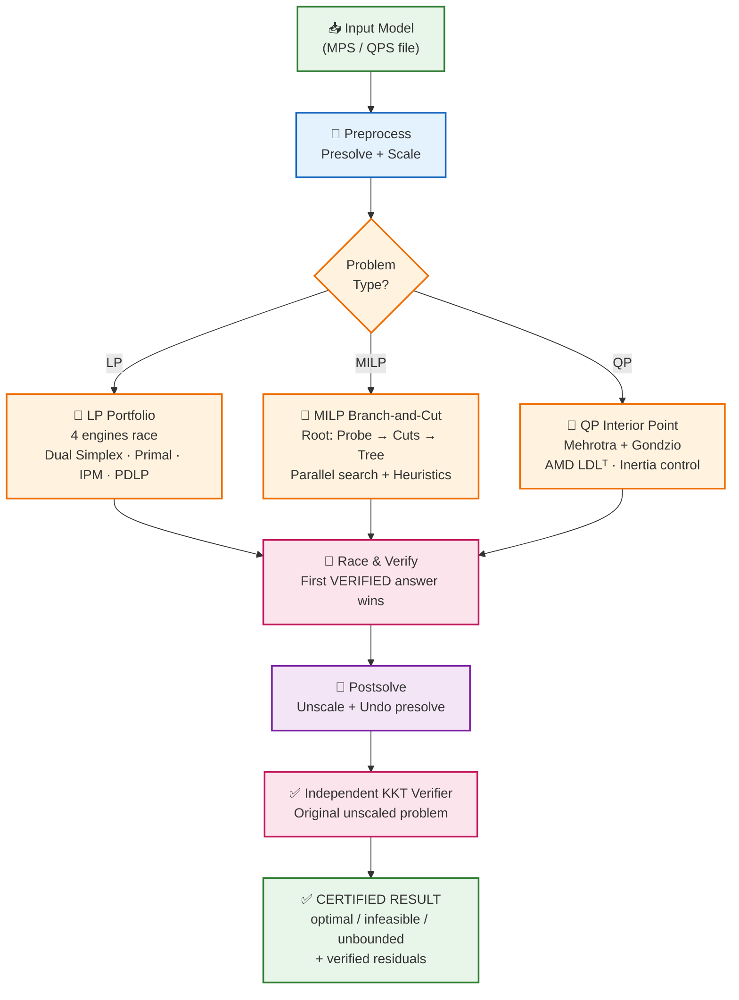
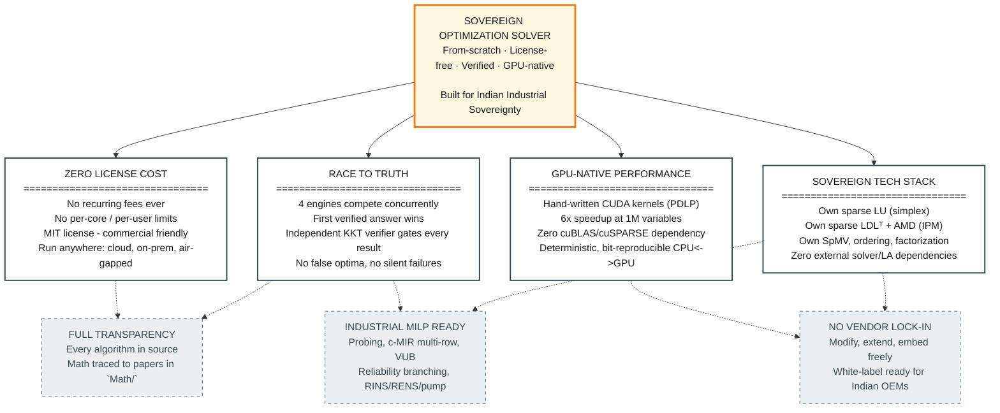
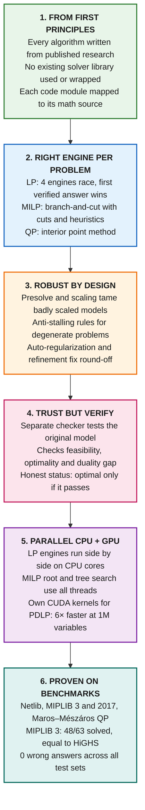

# Sovereign Optimization Solver
**SIH 2026 · PS 26119 · MRPL**  
*A from-scratch, license-free LP/MILP/QP solver with GPU acceleration, concurrent engine portfolio, and independent KKT verification — built entirely from mathematical foundations for Indian industrial sovereignty.*

---

## 📑 Table of Contents
1. [Executive Summary](#executive-summary)
2. [Problem & Solution](#problem--solution)
3. [Unique Value Proposition](#unique-value-proposition)
4. [Technical Approach](#technical-approach)
5. [Results & Benchmarks](#results--benchmarks)
6. [Verification Methodology](#verification-methodology)
7. [Software Architecture](#software-architecture)
8. [Build & Run](#build--run)
9. [Comparison: Sovereign vs HiGHS](#comparison-sovereign-vs-highs)
9. [Screenshots](#screenshots)
10. [Limitations & Roadmap](#limitations--roadmap)
10. [Project Layout](#project-layout)

---

## 🎯 Executive Summary

| Metric | Value |
|--------|-------|
| **Problem Types** | LP, MILP, convex QP |
| **Languages** | C++17 + CUDA (hand-written kernels) |
| **Dependencies** | Zero external solver/LA libraries |
| **License** | MIT (free, commercial-friendly) |
| **Verification** | Independent KKT on original problem |
| **GPU Speedup** | 6× at 1M variables (PDLP) |

**Core Philosophy:** Built entirely from published mathematics — no third-party solver or linear-algebra library in the solve path. Every answer is independently verified on the original, unscaled problem before being certified.

---

## 🎯 Problem & Solution

### The Problem (MRPL Context)
MRPL plans and runs its refinery with mathematical optimization: crude selection, blending, unit scheduling, tank allocation, process optimization, logistics, power dispatch. Today this depends on commercial solvers that are **expensive, licensed per seat/core, and closed-source**.

### The Solution
**A from-scratch, Indian-built solver** for the three problem types these models use:

| Type | Refinery Application | Engine |
|------|---------------------|--------|
| **LP** | Crude blending, product slate | Concurrent portfolio (4 engines) |
| **MILP** | Unit on/off, scheduling, tank allocation | Parallel branch-and-cut |
| **QP** | Smooth operation, quality penalties | Primal-dual interior point |

---

## 🔄 Solution Flow: How the Solver Works



---

## 🎯 Unique Value Proposition

> **A from-scratch, license-free LP/MILP/QP solver with GPU-accelerated first-order methods, concurrent multi-engine portfolio, and independent KKT verification — built entirely from mathematical foundations for Indian industrial sovereignty.**

| Differentiator | What It Means |
|----------------|---------------|
| **Zero license cost** | No recurring fees, no per-core/user/model limits |
| **Full transparency** | Every algorithm in source, math traced to papers in `Math/` |
| **No vendor lock-in** | MIT license — modify, extend, embed freely |
| **GPU acceleration** | Hand-written CUDA kernels (6× at 1M vars), no cuBLAS/cuSPARSE |
| **Concurrent portfolio** | 4 engines race; first **verified** answer wins |
| **Independent verification** | Status from verifier on original problem, not engine |
| **Sovereign stack** | Own sparse LU, LDLᵀ, AMD ordering, SpMV |
| **Industrial MILP** | Probing, c-MIR, VUB, parallel tree, RINS/RENS |

---

## 🎯 UVP Visual



---

## 🔬 Methodology

### Methodology at a Glance



---

## ⚙️ Technical Approach

### From First Principles
Every algorithm implemented from peer-reviewed literature — **no third-party solver or LA library**:
- **Simplex**: Chvátal, Vanderbei, Forrest-Tomlin, Harris, Suhl-Suhl
- **IPM**: Mehrotra, Gondzio, Wright, Vanderbei
- **PDLP**: Applegate et al. (NeurIPS 2021, Math. Prog. 2023)
- **MILP**: Nemhauser-Wolsey, Marchand-Wolsey, Fischetti-Lodi
- **Sparse LA**: Davis (direct methods), AMD ordering

### Engine per Problem Class

| Class | Primary Engine | Key Features |
|-------|----------------|--------------|
| **LP** | Dual revised simplex (Markowitz LU, steepest edge, Harris BFRT) | Concurrent portfolio: 4 engines race; first **verified** answer wins |
| **MILP** | Parallel branch-and-cut | Probing, multi-row c-MIR, VUB, reliability branching, parallel tree |
| **QP** | Primal-dual IPM | Mehrotra + Gondzio, AMD LDLᵀ, equal primal/dual steps |

### Core Infrastructure
- **Sparse LA**: Own CSR/CSC, SpMV, matvec, Markowitz LU (Forrest-Tomlin), AMD-ordered LDLᵀ
- **Presolve**: 9 rule types (empty, singleton, redundant, forcing, doubleton, implied-free, dual fixing, integer rounding)
- **Scaling**: Ruiz + Pock-Chambolle (integer columns never scaled)
- **Verification**: Independent KKT on **original, unscaled** problem

### Parallelism & GPU
| Level | Strategy |
|-------|----------|
| LP Portfolio | 4 engines in parallel; first verified wins |
| MILP Root | Probing + cut separation per-thread with deterministic merge |
| MILP Tree | Separate mutexes for node pool / incumbent / pseudocosts; compact nodes |
| GPU | PDLP only — warp-per-row SpMV, fused kernels, deterministic reductions → **6× at 1M vars** |

### Numerical Robustness (Built-in)
- Iterative refinement (simplex every solve, IPM up to 10 steps)
- Inertia control / dynamic regularization (IPM)
- Dependent equality row removal (IPM)
- Cost perturbation (deterministic, hash-based) for dual degeneracy
- Bland's fallback (guaranteed termination)
- Integer columns never scaled (preserves integrality exactly)

---

## 📊 Results & Benchmarks

**Environment:** RTX 3050 laptop, 12 threads, HiGHS 1.15.1 reference

### Netlib LP (91 problems)
| Engine | Result | vs HiGHS |
|--------|--------|----------|
| Dual simplex | **91/91 optimal** | 46s vs 19s; 1.3× pivot count |
| PDLP → crossover → simplex | **91/91 optimal** | |
| Interior point | 85/91 optimal | 4 stalls (bnl2, finnis, greenbea, dfl001) |

### Maros–Mészáros QP (134 problems)
| Engine | Result |
|--------|--------|
| Interior point | **119/134 certified optimal** (110 match published, 9 certified gap ≤ 1e-11) |

### MIPLIB 3 (63 problems, 60s, 4 threads)
| Metric | Sovereign | HiGHS (1 thread) |
|--------|-----------|------------------|
| Proven optimal | **47/63** | 48/63 |
| Wrong answers | **0** | 0 |
| Faster on | **24 instances** | 24 instances |

### Refinery Planning (generated models)
| Model | Result | vs HiGHS |
|-------|--------|----------|
| 12×12 / 30×24 MILP | Matches exactly | 1.7s vs 0.95s |
| QP variant | Matches exactly | |

### GPU Performance (1M variable transportation LP, 2M nonzeros)
| Engine | Time | Speedup |
|--------|------|---------|
| CPU PDLP | 48.4 s | — |
| **GPU PDLP** | **8.1 s** | **6.0×** (same iterations, bit-reproducible) |

**Key:** Dual simplex remains fastest to a **verified vertex** on every LP tried (17.5s on 1M vars). PDLP+cross+simplex takes longer due to dense post-crossover pivots.

---

## ✅ Verification Methodology

**Independent KKT verifier** (`src/verify.cpp`) runs on the **original, unscaled, unpresolved** problem:

| Check | Tolerance | Status |
|-------|-----------|--------|
| Primal feasibility (eps_P) | ≤ 1e-6 | `optimal` |
| Dual feasibility (eps_D) | ≤ 1e-6 | `optimal` |
| Duality gap (eps_G) | ≤ 1e-6 | `optimal` |
| ≤ 1e-4 | `near_optimal` |
| > 1e-4 | `inaccurate` (honest) |

- `--check` verifies **any** solver's solution file
- `--check` used to audit HiGHS answers with same verifier
- Status comes from verifier, **never from engine**

---

## 🏗️ Software Architecture

```
CLI / Web UI / Python API
         │
         ▼
    solve.cpp (orchestrator)
         │
    ┌────┴────┬────────┬────────┬────────┐
    ▼         ▼        ▼        ▼        ▼
  SIMPLEX    IPM      PDLP     MILP    SHARED
  (LU)       (LDLᵀ)   (CPU/GPU) B&C     (Reader, Presolve, Scaling, Verifier, Sparse LA)
```

### Code Modules
| Module | Purpose |
|--------|---------|
| `mps_reader.cpp` | MPS/QPS parser (free/fixed, RANGES, BOUNDS, QUADOBJ) |
| `presolve.cpp` / `scaling.cpp` | 9 presolve rules + Ruiz + Pock-Chambolle scaling |
| `basis_lu.cpp` / `simplex.cpp` | Dual/primal simplex, Markowitz LU, Forrest-Tomlin |
| `qp_ipm.cpp` / `sparse_ldl.cpp` | IPM with Mehrotra+Gondzio, AMD LDLᵀ |
| `pdlp.cpp` / `pdlp_gpu_solve.cu` | PDLP (shared algo, CPU + CUDA backends) |
| `mip.cpp` / `mip_probe.cpp` | Branch-and-cut, probing, cuts, heuristics, parallel tree |
| `verify.cpp` | Independent KKT on original problem |
| `sparse_ldl.cpp` / `basis_lu.cpp` | Sparse LDLᵀ (AMD) + LU with Forrest-Tomlin |

**Key Pattern:** `pdlp_algo.hpp` — single algorithm template instantiated for CPU + GPU backends.

---

## 🛠️ Build & Run

### Build
```bash
cmake -S . -B build -DCMAKE_BUILD_TYPE=Release
cmake --build build --config Release -j 8
# -DSOVEREIGN_FORCE_CPU=ON for CPU-only baseline
# CMAKE_CUDA_ARCHITECTURES=86 (RTX 30xx)
```

### Run Commands
```bash
# Auto engine by type
sovereign_solve model.mps [time_limit]

# Explicit engines
sovereign_solve --concurrent model.mps     # LP portfolio
sovereign_solve --simplex model.mps        # dual simplex only
sovereign_solve --auto model.mps           # simplex vs PDLP+cross race
sovereign_solve --ipm model.mps            # LP/QP interior point
sovereign_solve --mip model.mps            # MILP branch-and-cut
sovereign_solve --pdlp model.mps           # PDLP only (CPU/GPU race)

# Verification & I/O
sovereign_solve --check=solution.txt model.mps
sovereign_solve --json=out.json --sol=out.sol --csv=out model.mps
```

### Web UI
```bash
python tools/ui_server.py   # opens http://127.0.0.1:8765
# Upload .mps/.qps, watch live log, download .sol/CSV/JSON
```

---

## ⚖️ Comparison: Sovereign vs HiGHS

| Aspect | Sovereign | HiGHS | Advantage |
|--------|-----------|-------|-----------|
| **License** | MIT | MIT | Tie |
| **GPU Support** | Yes (PDLP, 6×) | No | **Sovereign** |
| **LP Engines** | 4 (race) | 2 | **Sovereign** |
| **Verification** | Independent KKT (original) | Internal | **Sovereign** |
| **Netlib LP (91)** | 91/91 optimal | 91/91 optimal | Tie |
| **Netlib Time** | 46s | 19s | HiGHS 2.4× |
| **MIPLIB 3 (63, 4t)** | 47/63 opt, 0 wrong | 48/63 opt | Tie |
| **GPU PDLP (1M vars)** | 8.1s (6×) | N/A | **Sovereign** |
| **MILP Cuts** | GMI, c-MIR, VUB, cover, clique | More types | HiGHS |
| **Hypersparse Solves** | Not yet | Yes | HiGHS |
| **Nested Dissection** | AMD only | Yes | HiGHS |
| **GCD/Symmetry/Lifted** | Not yet | Yes | HiGHS |
| **IPM Stability** | Stalls on 4 Netlib | Fewer | HiGHS |
| **License Cost** | Free (MIT) | Free (MIT) | Tie |
| **Air-gapped / Offline** | Yes | Yes | Tie |

**Bottom line:** Sovereign wins on GPU, verification, portfolio, sovereignty; HiGHS wins on mature MILP cut breadth, simplex speed, IPM stability.

---

## 📸 Screenshots

| | |
|---|---|
| **Solver Configuration** | **Results Dashboard** |
|  |  |
| **Live Solver Log** | **Variable/Constraint Tables** |
|  |  |

*Screenshots from local web UI (http://127.0.0.1:8765): configuration panel, results dashboard with verified status/residuals, live solver log, searchable variable/constraint tables.*

---

## ⚠️ Limitations & Roadmap

### Known Limitations
| Area | Status |
|------|--------|
| **Simplex speed** | 1.3× HiGHS pivots; dense FTRAN/BTRAN (no hypersparse yet) |
| **MILP cuts** | Missing GCD tightening, symmetry, lifted covers, local tree cuts |
| **IPM stalls** | LISWET, YAO, 4 Netlib LPs (simplex fallback works) |
| **GPU scope** | Only PDLP; no multi-GPU |
| **Community** | New project vs established HiGHS/COIN-OR |

### Roadmap
| Priority | Item | Effort |
|----------|------|--------|
| High | Hypersparse FTRAN/BTRAN | Medium |
| High | Nested dissection ordering | Medium |
| High | GCD tightening, symmetry breaking | Medium |
| Medium | Lifted covers, local tree cuts | Medium |
| Medium | GPU cut scoring, parallel heuristics | Large |
| Future | NLP (filter SQP) → MINLP | Large |
| Future | Modeling language (PyMOO-like) | Separate project |

---

## 📁 Project Layout

```
include/, src/     Engine (one header per module), main.cpp = CLI
gpu/               pdlp_gpu_solve.cu (CUDA backend); pdlp_spmv_kernel.cu (reference)
tests/             run_checks.cpp, test_lu.cpp, test_ldl.cpp
tools/             benchmark.py, gen_lp.cpp, audit_lp.cpp, gen_refinery.py, ui_server.py
sample_problems/   Small Netlib / MIPLIB 3 / Maros-Mézáros for run_checks
Math/              Pipeline PDFs + PIPELINE_NOTES.md (agreed corrections)
Pics/              UI screenshots
Presentation/      SIH2026-IDEA-Presentation-Format.pptx + generated PPTX
```

---

## 🔗 Key Files for Judges

| File | Purpose |
|------|---------|
| `src/verify.cpp` | Independent KKT verifier (read this for trust model) |
| `include/pdlp_algo.hpp` | Single PDLP algorithm for CPU + GPU |
| `Math/PIPELINE_NOTES.md` | Math-to-code mapping with corrections |
| `Presentation/Sovereign_Solver_SIH2026.pptx` | 6-slide presentation matching SIH template |
| `tools/ui_server.py` | Local web UI (stdlib only) |

---

**Built for Indian industrial sovereignty — every line written from published mathematics, verified independently, ready for MRPL and beyond.**