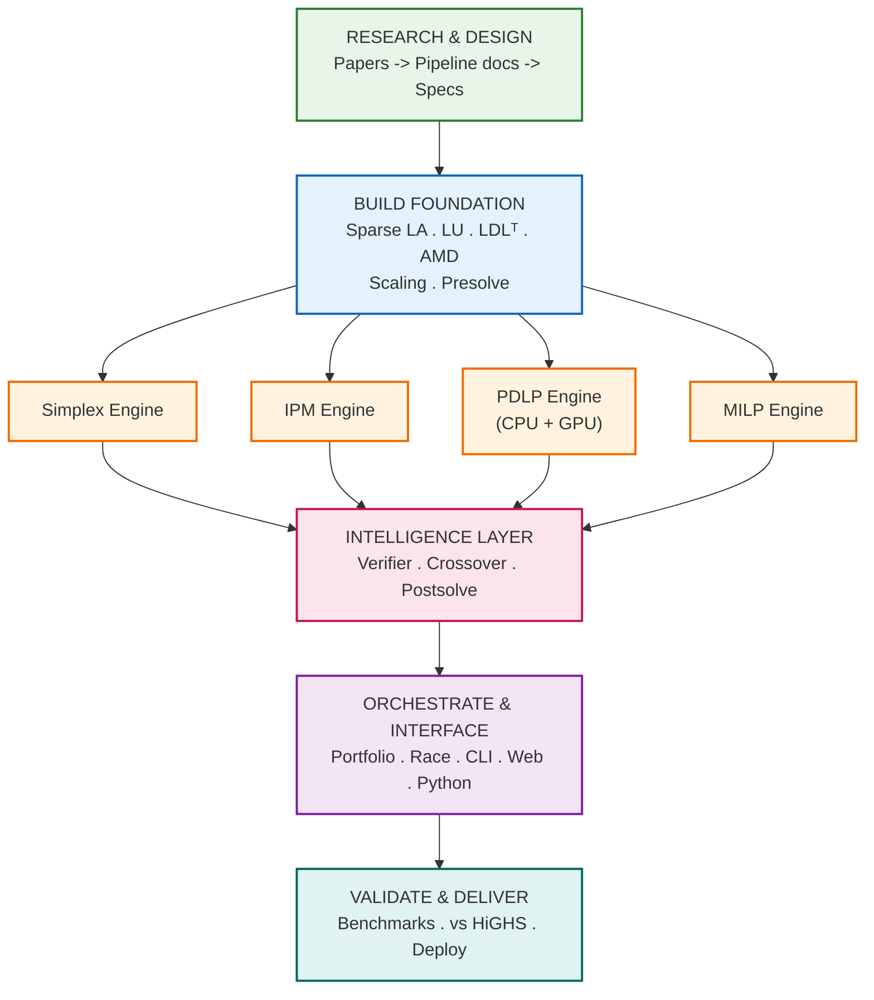
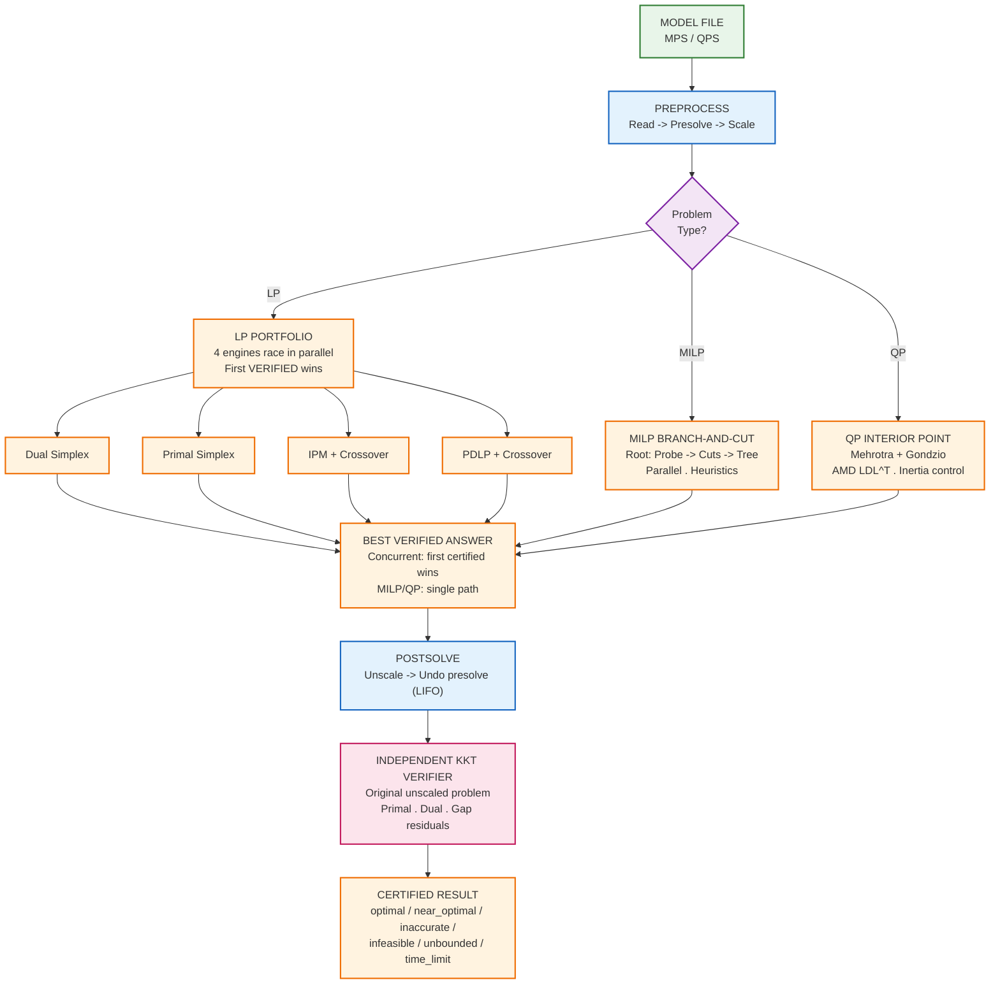
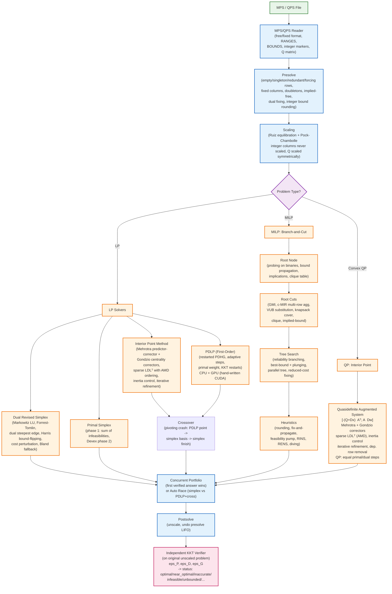
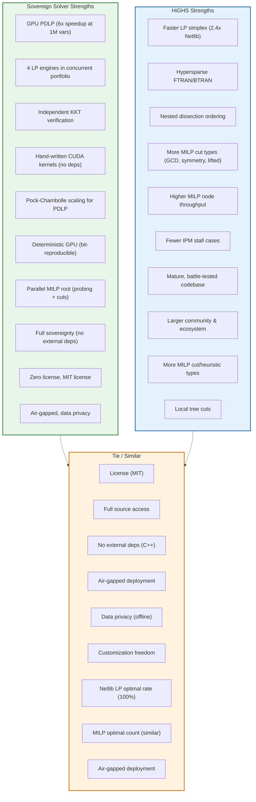
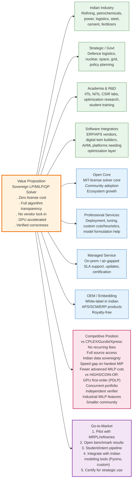
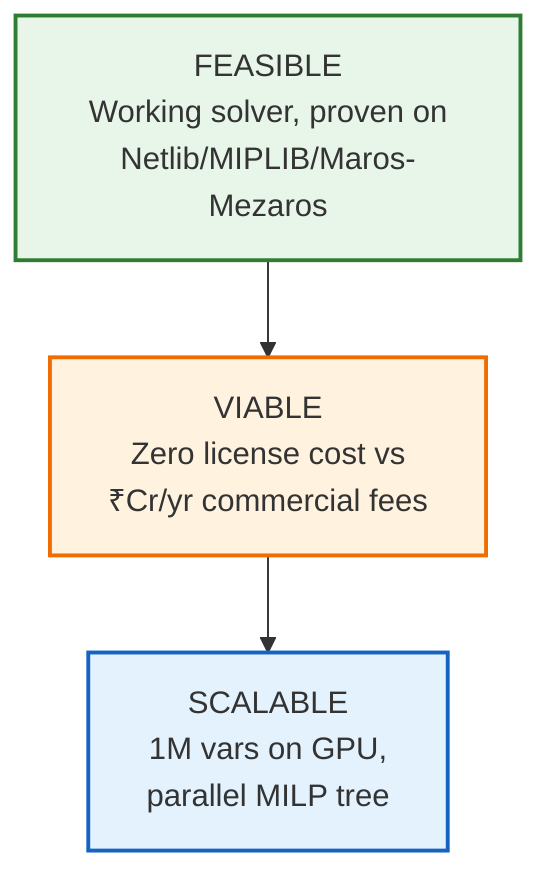
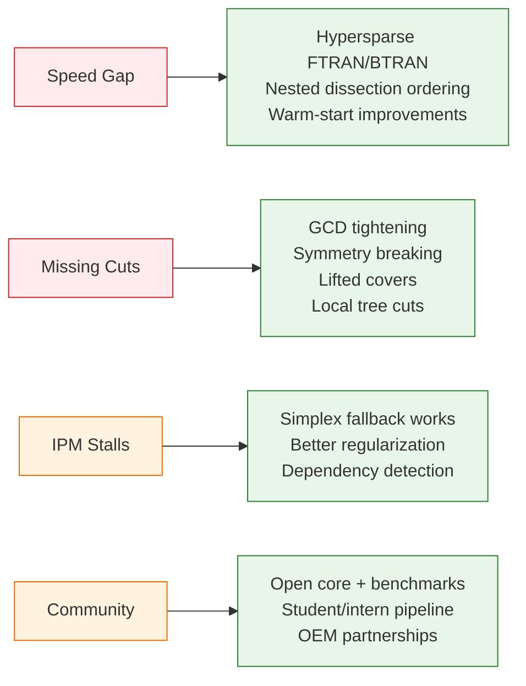
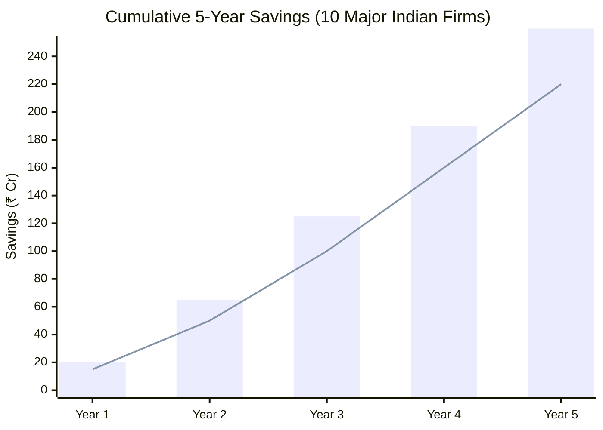

# Suprema Optimization Solver (SIH 2026 · PS 26119 · MRPL)

## 📑 Table of Contents
- [🎯 Unique Value Proposition](#-unique-value-proposition)
- [📊 UVP Visual](#uvp-visual)
- [🔬 Methodology](#methodology)
- [⚙️ Implementation Process](#implementation-process)
- [🔄 Solution Flow](#solution-flow-from-model-to-verified-answer)
- [📦 What is in the Box](#what-is-in-the-box)
- [📚 Mathematical Foundations](#mathematical-foundations-with-references)
  - [Mathematical Architecture Overview](#mathematical-architecture-overview)
  - [Software Architecture: Code Modules](#software-architecture-code-modules--interfaces)
  - [Linear Programming](#linear-programming-mathlp_solver_pipeline_updatedpdf)
  - [Mixed-Integer Linear Programming](#mixed-integer-linear-programming-mathmilp_solver_pipeline-1pdf)
  - [Quadratic Programming](#quadratic-programming-mathqp_solver_pipelinepdf)
- [🛠️ Build](#build)
- [🚀 Run](#run)
- [⌨️ Command-line Showcase](#command-line-showcase)
- [🌐 Interface](#interface)
- [🧪 Tests and Benchmarks](#tests-and-benchmarks)
- [📈 Results](#results-rtx-3050-laptop-12-threads-reference-highs-1151-2026-09-27)
- [⚖️ Comparison: Suprema vs HiGHS](#comparison-sovereign-solver-vs-highs)
- [⚠️ Honest Limitations](#honest-limitations-read-before-presenting)
- [✨ Capabilities Summary](#capabilities-summary-what-this-solver-delivers)
- [🗺️ Roadmap](#roadmap-whats-next)
- [💼 Business Model & Market Analysis](#business-model--market-analysis)
- [📊 Feasibility & Viability](#feasibility--viability)
- [🌍 Impact & Benefits](#impact--benefits)
- [📁 Layout](#layout)

---

## 🛠️ Tech Stack

| Layer | Technologies |
|-------|--------------|
| **Core Language** | C++17 (ISO standard, no extensions) |
| **GPU Compute** | CUDA 11+/12+ (hand-written kernels, no cuBLAS/cuSPARSE) |
| **Build System** | CMake 3.18+ (auto-detects CUDA, supports `-DSOVEREIGN_FORCE_CPU=ON`) |
| **Parallelism** | C++17 `std::thread`, `std::atomic`, `std::mutex`, `std::condition_variable` |
| **Linear Algebra** | **Custom**: Sparse CSR/CSC, Markowitz LU (Forrest-Tomlin), AMD-ordered LDLᵀ, SpMV |
| **I/O** | MPS/QPS parser (free/fixed format, RANGES, BOUNDS, QUADOBJ/QMATRIX) |
| **CLI** | Pure C++ (arg parsing, colored output, JSON/CSV/.sol writers) |
| **Web UI** | Python 3 stdlib only (`http.server`, `json`, `threading`) — zero deps |
| **Benchmarking** | Python 3 + `highspy` (optional HiGHS comparison) |
| **Testing** | Custom C++ test binaries (`test_lu`, `test_ldl`, `run_checks`) |
| **Documentation** | Mermaid diagrams (rendered on GitHub/GitLab), Markdown |
| **Version Control** | Git, GitHub |

**No external solver libraries** (CBC, HiGHS, CLP, OSQP, etc.)  
**No external linear-algebra libraries** (SuiteSparse, MKL, Eigen, BLAS, LAPACK)  
**No cloud dependencies** — runs fully offline, air-gapped compatible

---

## 🎯 Unique Value Proposition

> **The only from-scratch, license-free LP/MILP/QP solver with GPU-accelerated first-order methods, concurrent multi-engine portfolio, and independent KKT verification — built entirely from mathematical foundations for Indian industrial sovereignty.**

| Differentiator | What It Means |
|----------------|---------------|
| **Zero license cost** | No recurring fees, no per-core/user/model limits — run anywhere, any scale |
| **Full transparency** | Every algorithm in source (`src/`/`include/`), math traced to papers in `Math/` |
| **No vendor lock-in** | MIT-style, modify/extend/embed freely; no black boxes |
| **GPU acceleration** | Hand-written CUDA kernels for PDLP (6× speedup at 1M vars), no cuBLAS/cuSPARSE |
| **Concurrent portfolio** | Dual/Primal Simplex + IPM + PDLP race; first **verified** answer wins |
| **Independent verification** | Every solution checked on original unscaled problem — status follows verifier, not engine |
| **Sovereign stack** | Own sparse LU, LDLᵀ, AMD ordering, SpMV — zero external solver/LA dependencies |
| **Industrial MILP** | Probing, c-MIR multi-row, VUB/flow-cover, reliability branching, parallel tree, RINS/RENS/pump |
 
---

## UVP Visual


---

## Methodology

### 1. Mathematical Foundation — From First Principles
Every algorithm is implemented from peer-reviewed literature, not wrapped from existing libraries:
- **Simplex**: Chvátal, Vanderbei, Forrest-Tomlin, Harris, Suhl-Suhl
- **IPM**: Mehrotra, Gondzio, Wright, Vanderbei (quasidefinite systems)
- **PDLP**: Applegate et al. (NeurIPS 2021, Math. Prog. 2023)
- **MILP**: Nemhauser-Wolsey, Marchand-Wolsey, Fischetti-Lodi, Danna-Rothberg-Le Pape
- **Sparse LA**: Davis (direct methods), AMD ordering (Amestoy-Davis-Duff)

Pipeline documents in `Math/` + `PIPELINE_NOTES.md` map each code module to its mathematical source.

### 2. Algorithmic Strategy per Problem Class

| Class | Primary Engine | Fallback / Hybrid | Key Design Choices |
|-------|----------------|-------------------|---------------------|
| **LP** | Dual revised simplex (Markowitz LU, steepest edge, Harris BFRT) | Primal simplex, IPM+crossover, PDLP+crossover | Concurrent portfolio — first *verified* answer wins |
| **QP** | Primal-dual IPM (Mehrotra + Gondzio correctors) | — | Quasidefinite augmented system, equal primal/dual steps |
| **MILP** | Branch-and-cut (warm-started dual simplex at every node) | — | Parallel root (probing + cuts), reliability branching, compact nodes |

### 3. Numerical Robustness — Built In, Not Bolted On

| Technique | Where Applied | Purpose |
|-----------|---------------|---------|
| Iterative refinement | Simplex (every solve), IPM (up to 10 steps) | Remove rounding error & regularization bias |
| Inertia control / dynamic regularization | IPM (LDLᵀ) | Fix wrong-sign pivots adaptively |
| Dependent equality row removal | IPM | Prevent singular KKT, dual corruption |
| Cost perturbation (deterministic) | Simplex | Handle dual degeneracy |
| Bland's rule fallback | Simplex | Guaranteed termination |
| Symmetric Q scaling | QP | Preserve convexity |
| Integer columns never scaled | Presolve/Postsolve | Preserve integrality exactly |

### 4. Verification Methodology — Trust But Verify
**Independent KKT verifier** (`src/verify.cpp`) runs on the **original, unscaled, unpresolved** problem:
- Checks primal feasibility (eps_P), dual feasibility (eps_D), duality gap (eps_G)
- Status follows verifier, not engine: `optimal` (≤1e-6), `near_optimal` (≤1e-4), `inaccurate` (>1e-4)
- `--check` verifies *any* solver's solution file

### 5. Parallelization Strategy

| Level | Approach |
|-------|----------|
| **LP Portfolio** | 4 engines on separate threads; first verified wins; helpers start only if dual simplex >50ms |
| **MILP Root** | Probing in chunks (snapshot+merge); cut separation per-thread with scratch buffers; deterministic merge |
| **MILP Tree** | Separate mutexes (node pool / incumbent / pseudocosts); compact nodes (own changes + shared parent trail) |
| **GPU** | PDLP only — warp-per-row SpMV, fused kernels, deterministic reductions |

### 6. GPU Approach — Sovereign Kernels
- **No cuBLAS/cuSPARSE** — hand-written CUDA only
- **Warp-per-row CSR SpMV** for A·x and Aᵀ·y
- **Fused kernels** for primal/dual steps + adaptive step-size reductions
- **Deterministic reductions**: per-block partials summed in fixed order → CPU↔GPU bit-reproducible
- **6× speedup** at 1M variables (transport LP)
 
---

## Implementation Process



---

## Solver Working: Minimal Schematic



---

## What is in the box

| Problem | Engine | Where |
|---|---|---|
| LP | **Dual revised simplex** — Markowitz LU (Suhl–Suhl dual storage) with Forrest–Tomlin updates, dual steepest edge, bound-flipping + Harris ratio test, dual phase 1 by artificial bounding, cost perturbation, Bland fallback, primal simplex cleanup | `src/basis_lu.cpp`, `src/simplex.cpp` |
| LP | **Restarted PDLP** (adaptive steps, primal weight, KKT restarts) — one algorithm (`include/pdlp_algo.hpp`), two backends: CPU and hand-written CUDA kernels (no cuBLAS/cuSPARSE), deterministic reductions | `src/pdlp.cpp`, `gpu/pdlp_gpu_solve.cu` |
| LP | **Crossover** PDLP point → simplex basis (pivoting crash), then simplex to machine precision | `DualSimplex::crossover_start` |
| LP | **Primal simplex** — phase 1 minimizing the sum of infeasibilities (breakpoint ratio test), Devex phase 2 | `DualSimplex::solve_primal` |
| LP | **Concurrent portfolio (default for LP)**: one presolve, then dual simplex (calling thread), primal simplex, IPM+crossover and PDLP(GPU)+crossover on their own threads; each answer is postsolved and checked by the verifier, the first certified one wins and cancels the rest. Helpers start only if the dual simplex has not finished within 50 ms (PDLP: 0.5 s, and only at ≥ 200k nonzeros), so easy LPs pay nothing | `solve_mps_concurrent` |
| LP | **Auto race**: dual simplex vs PDLP(GPU)+crossover — first verified answer wins | `solve_mps_simplex(..., race=true)` |
| LP, QP | **Primal-dual interior point** — Mehrotra predictor-corrector + Gondzio centrality correctors, quasidefinite augmented system, sparse LDLᵀ with minimum-degree ordering, dynamic regularization (inertia control), iterative refinement, dependent-row removal | `src/qp_ipm.cpp`, `src/sparse_ldl.cpp` |
| MILP | **Root reasoning** — bound propagation, probing on every binary (fixings, global tightenings, implications), clique table from set-packing/knapsack rows and implications | `src/mip_probe.cpp` |
| MILP | **Branch-and-cut** — warm-started dual simplex at every node; Gomory mixed-integer, c-MIR with multi-row aggregation (up to 6 rows, Marchand–Wolsey) and variable-upper-bound substitution (flow-cover / path strength), knapsack cover, clique and implied-bound cuts; reliability branching (strong branching → pseudocosts); best-bound + plunging; reduced-cost fixing; rounding, fix-and-propagate, feasibility pump, RENS, RINS, diving; **multi-threaded tree search** with separate locks for the node pool, incumbent and pseudocosts, and compact nodes (each stores only its own bound changes); **parallel root**: probing in chunks across threads (snapshot + merge) and Gomory / aggregated c-MIR separation across threads with per-thread scratch buffers, results collected in a fixed order | `src/mip.cpp` |
| all | MPS/QPS reader (free + fixed format, RANGES, all BOUNDS types, integer markers, QUADOBJ/QMATRIX), presolve with primal-dual postsolve (empty/singleton/redundant/forcing rows, fixed columns, dual fixing, doubleton equations, implied-free substitution / aggregator), Ruiz/Pock–Chambolle scaling (integer columns never scaled, Q scaled symmetrically) | `src/mps_reader.cpp`, `src/presolve.cpp`, `src/scaling.cpp` |

---

## Mathematical foundations (with references)

All algorithms are implemented from the mathematical literature. The three pipeline PDFs in `Math/` describe the intended design; `Math/PIPELINE_NOTES.md` records the corrections we made during implementation.

---

### Mathematical Architecture Overview



---

## Software Architecture: Code Modules & Interfaces

```mermaid
flowchart TB
    %% Entry Points
    CLI["CLI\n(main.cpp)"]
    UI["Web UI\n(tools/ui_server.py)"]
    PY["Python API\n(tools/sovereign.py)"]
    
    %% Core Solve Orchestration
    CLI --> SOLVE["solve.cpp\n(orchestrates all engines)"]
    UI --> SOLVE
    PY --> SOLVE
    
    %% Shared Foundation (used by all engines)
    SOLVE --> READ["mps_reader.cpp\n(MPS/QPS parser)"]
    SOLVE --> PRESOLVE["presolve.cpp\n(presolve + postsolve)"]
    SOLVE --> SCALE["scaling.cpp\n(Ruiz + Pock-Chambolle)"]
    SOLVE --> VERIFY["verify.cpp\n(independent KKT checker)"]
    SOLVE --> SPARSE["sparse.hpp / sparse.cpp\n(CSR/CSC, SpMV, matvec)"]
    
    %% LP Engines
    SOLVE --> SIMPLEX["simplex.cpp + basis_lu.cpp\n(Dual/Primal Simplex\nMarkowitz LU, Forrest-Tomlin,\nsteepest edge, Harris, perturbation)"]
    SOLVE --> PDLP_CPU["pdlp.cpp\n(PDLP CPU backend)"]
    SOLVE --> PDLP_GPU["gpu/pdlp_gpu_solve.cu\n(PDLP GPU kernels\nwarp-per-row SpMV, fused updates)"]
    SOLVE --> IPM["qp_ipm.cpp\n(Primal-Dual IPM\nMehrotra + Gondzio)"]
    SOLVE --> LDL["sparse_ldl.cpp\n(Sparse LDLᵀ + AMD ordering)"]
    
    %% MILP Engine
    SOLVE --> MIP["mip.cpp\n(Branch-and-Cut\ntree, cuts, branching, heuristics)"]
    SOLVE --> MIP_PROBE["mip_probe.cpp\n(Probing, clique table,\nimplications)"]
    
    %% PDLP Shared Algorithm (single source)
    PDLP_CPU --> PDLP_ALGO["include/pdlp_algo.hpp\n(PDLP algorithm template\ninstantiated for CPU + GPU)"]
    PDLP_GPU --> PDLP_ALGO
    
    %% Reporting & Stats
    SOLVE --> REPORT["report_io.cpp\n(JSON, CSV, .sol output)"]
    SOLVE --> ALLOC["alloc_stats.cpp\n(counting allocator\nheap tracking)"]
    
    %% Testing
    TEST_LU["test_lu.cpp\n(LU factorization tests)"]
    TEST_LDL["test_ldl.cpp\n(LDLᵀ tests)"]
    TEST_CHECKS["run_checks.cpp\n(end-to-end tests)"]
    
    SIMPLEX --> TEST_LU
    LDL --> TEST_LDL
    SOLVE --> TEST_CHECKS
    
    %% Styling
    style CLI fill:#e3f2fd,stroke:#1565c0
    style UI fill:#e3f2fd,stroke:#1565c0
    style PY fill:#e3f2fd,stroke:#1565c0
    style SOLVE fill:#fff3e0,stroke:#ef6c00,stroke-width:2px
    style READ fill:#e8f5e9,stroke:#2e7d32
    style PRESOLVE fill:#e8f5e9,stroke:#2e7d32
    style SCALE fill:#e8f5e9,stroke:#2e7d32
    style VERIFY fill:#fce4ec,stroke:#c2185b,stroke-width:2px
    style SPARSE fill:#e8f5e9,stroke:#2e7d32
    style SIMPLEX fill:#fff3e0,stroke:#ef6c00
    style PDLP_CPU fill:#fff3e0,stroke:#ef6c00
    style PDLP_GPU fill:#fff3e0,stroke:#ef6c00
    style IPM fill:#fff3e0,stroke:#ef6c00
    style LDL fill:#fff3e0,stroke:#ef6c00
    style MIP fill:#fff3e0,stroke:#ef6c00
    style MIP_PROBE fill:#fff3e0,stroke:#ef6c00
    style PDLP_ALGO fill:#f3e5f5,stroke:#7b1fa2,stroke-width:2px
    style REPORT fill:#e8f5e9,stroke:#2e7d32
    style ALLOC fill:#e8f5e9,stroke:#2e7d32
```



---

### Linear Programming (`Math/LP_Solver_Pipeline updated.pdf`)

**1. Parsing & condition screening** (Step 1)  
MPS/QPS reader handles free/fixed format, RANGES, all BOUNDS types, integer markers. A quick condition screen flags huge coefficients, near-zero rows/columns, and empty problems before any real work starts.

**2. Presolve** (Step 2) — `src/presolve.cpp`  
Repeated passes of:
- **Empty rows/columns** — drop them (R1, R2)
- **Singleton rows** — one variable, bounds implied by the row (R4)
- **Fixed columns** — variable at a bound, substitute out (R3)
- **Redundant rows** — activity range strictly inside bounds (RR)
- **Forcing rows** — activity pinned at a bound, all variables forced to their bounds (FR)
- **Doubleton equations** — two variables, substitute one out (DT)
- **Implied-free substitution / aggregator** — in an equality row, pick a variable whose bounds are implied by the other rows, substitute it everywhere (FCS)
- **Dual fixing** — column's reduced cost sign and row bounds imply a fix (R3)
- **Integer bound rounding** — for MILP, round integer variable bounds inward (preserves integer feasible set)

Postsolve undoes these steps in reverse order, recovering primal/dual variables and reduced costs for the original problem.

**3. Scaling** (Step 3) — `src/scaling.cpp`  
- **Ruiz equilibration** (alternating row/column scaling to make ∞-norms ≈ 1)
- **Pock–Chambolle** (further balances the matrix for first-order methods)
- Integer columns are **never** column-scaled (would break integrality). Q matrix (if present) is scaled symmetrically.

**4. PDLP — Primal-Dual Hybrid Gradient** (Step 3, alternate engine) — `include/pdlp_algo.hpp`, `src/pdlp.cpp`, `gpu/pdlp_gpu_solve.cu`  
Implements the restarted PDLP of Applegate et al. (NeurIPS 2021, later versions):
- Problem form: `min cᵀx s.t. Ax = b (equalities), Ax ≥ b (inequalities), l ≤ x ≤ u`
- PDHG step with primal weight `w`: `τ = η/w`, `σ = η·w`
  - `x' = proj_X(x - τ(c - Aᵀy))`
  - `y' = proj_Y(y + σ(b - A(2x' - x)))`
- **Adaptive step size**: accept iff `η ≤ η̄` where `η̄ = (w‖dx‖² + ‖dy‖²/w) / (2|(dy)ᵀA dx|)`; next `η = min((1-(k+1)⁻⁰·³)η̄, (1+(k+1)⁻⁰·⁶)η)`
- **Step-size-weighted ergodic average** of iterates
- **KKT-based restarts**: to the better of {current, average} when sufficient decay (0.2), necessary decay with no progress (0.8), or artificial restart after 36% of iterations
- **Primal weight update** at each restart: `w = exp(0.5 log(‖dy‖/‖dx‖) + 0.5 log w)`
- Termination judged on the **unscaled** problem via the independent verifier every `check_every` steps
- **GPU backend**: warp-per-row CSR SpMV (A x and Aᵀ y), fused primal/dual updates, fused reductions for adaptive step size — all in hand-written CUDA, no cuBLAS/cuSPARSE. Deterministic reductions (per-block partials summed in fixed order) make CPU and GPU bit-reproducible.

**5. Crossover** (Step 4) — `DualSimplex::crossover_start`  
A **pivoting crash** (not the full Megiddo push): structural variables enter the slack basis in basicness order, each replacing only a logical variable, so the basis stays nonsingular by construction. The simplex then finishes with cost shifting for small dual infeasibilities and dual phase 1 for large ones.

**6. Dual revised simplex** (Step 5) — `src/simplex.cpp`, `src/basis_lu.cpp`  
- **Basis representation**: Suhl–Suhl dual storage (column + row linked lists)
- **LU factorization**: Markowitz pivot selection with threshold; **Forrest–Tomlin** rank-1 updates (up to 100 updates before refactorization — Note 6)
- **Pricing**: Dual steepest edge (Harris, 1973) with weights updated by Forrest–Tomlin formula
- **Ratio test**: **Harris two-pass bound-flipping** (Note 5) — passes breakpoints of boxed variables while the leaving variable stays infeasible; within the final group picks the largest |α|
- **Degeneracy handling** (Step 6.1, Note 3): **Cost perturbation** (deterministic, hash of column index), not bound perturbation. Bland's rule as rare fallback (triggered after 1000 pivots without objective progress; never fired on full Netlib)
- **Dual phase 1** (Note 2): Artificial bounding — every variable gets a small box making every basis dual feasible after bound flips; optimizing minimizes the sum of dual infeasibilities of the original problem
- **Primal simplex cleanup** (Step 6.2): After dual simplex reaches optimality, restore original costs, run primal simplex (phase 1 minimizing sum of infeasibilities with breakpoint ratio test, Devex phase 2) to remove any remaining perturbations/shifts
- **Iterative refinement** on every primal solve (one step)

**7. Postsolve & verification** (Step 7) — `src/verify.cpp`  
Unscale, undo presolve (last-in, first-out), then run the **independent KKT verifier** on the original problem. The reported status (`optimal`, `near_optimal`, `inaccurate`, `infeasible`, `unbounded`, …) follows the verifier's residuals, not the engine's internal view.

---

### Mixed-Integer Linear Programming (`Math/MILP_Solver_Pipeline-1.pdf`)

**1–2. Integrality tagging & integer-aware presolve** — `src/presolve.cpp`  
Integer variables tagged from MPS integer markers. Presolve runs with `mip_mode=true`: integer columns are not eliminated by implied-free substitution; integer bounds are rounded inward.

**3–6. Root node** — `src/mip.cpp`, `src/mip_probe.cpp`  
- Root LP solved by dual simplex (PDLP optional via `--auto` for pure LP)
- **Probing** on every binary variable (Note: partial — bound propagation, fixings, global tightenings, implications implemented; GCD tightening, symmetry not yet)
- **Clique table** built from set-packing/knapsack rows and probing implications

**7. Root cuts** (partial — Note) — `src/mip.cpp`  
- **Gomory mixed-integer (GMI)** cuts from fractional basic integer variables
- **Complemented MIR (c-MIR)** with **multi-row aggregation** (up to 6 rows, Marchand & Wolsey) and **variable-upper-bound substitution** (flow-cover / path strength)
- **Knapsack cover cuts** on all-binary rows
- **Clique cuts** and **implied-bound cuts** from probing
- Parallel separation across threads with per-thread scratch buffers; results merged in fixed order for determinism
- **NOT yet implemented**: lifted covers, local cuts in the tree, GPU cut scoring

**8. Reliability branching** — `src/mip.cpp`  
Strong branching on top candidates (up to `strong_branch_candidates`), pseudocosts updated from strong branching observations; unobserved variables use running averages.

**9. Tree search** — `src/mip.cpp`  
- **Node selection**: best-bound + plunging (depth-first dives)
- **Parallel tree**: separate mutexes for node pool, incumbent, pseudocosts; compact nodes store only their own bound changes (parent trail shared via `shared_ptr`)
- **Pruning**: bound ≥ incumbent - gap, infeasibility, cutoff
- **Reduced-cost fixing** at each node
- **Heuristics**: rounding, fix-and-propagate (with row-wise bound propagation), feasibility pump (Fischetti, Glover & Lodi), RINS (Danna, Rothberg & Le Pape), RENS, fractional diving

**10–12. Gap, limits, verification**  
Absolute/relative gap, node/time/iteration limits. Every incumbent verified on the original problem (primal feasibility + integrality).

---

### Quadratic Programming (`Math/QP_Solver_Pipeline.pdf`)

**1. Convexity filter & symmetric scaling** — `src/scaling.cpp`, `src/qp_ipm.cpp`  
Q matrix scaled symmetrically (D Q D). Gershgorin filter not separate; inertia control in the IPM catches non-convexity.

**2. Presolve** — `src/presolve.cpp`  
LP presolve rules made Q-aware (Q entries carried through substitutions/aggregations).

**3. GPU ADMM warm start** — **Not implemented** (Note 7). IPM uses Mehrotra's starting point (regularized least-squares + interior shift).

**4–6. Primal-dual interior point** — `src/qp_ipm.cpp`, `src/sparse_ldl.cpp`  
- **Quasidefinite augmented system** (Vanderbei, 1999):
  ```
  [ -(Q + D_x)   Aᵀ ] [ dx ] = [ r_d ]
  [   A          D_w ] [ dλ ]   [ r_p ]
  ```
  with primal/dual regularization `dp`, `dd` (removed by refinement)
- **Mehrotra predictor-corrector** + **Gondzio multiple centrality correctors** (up to 3 extra Newton solves on the same factorization, targeting longer steps)
- **Sparse LDLᵀ** with **approximate minimum degree (AMD)** ordering (Note 4: no METIS — external library prohibited)
- **Dynamic regularization / inertia control**: if a pivot has wrong sign, regularize to `sign × max(|pivot|, reg)`; regularization reduced adaptively
- **Iterative refinement** against the unregularized K (up to 10 steps, keeps best)
- **Dependent equality rows** removed by sparse row-echelon reduction (prevents singular K and dual corruption)
- **Step rules**: LP keeps separate primal/dual steps; **QP forces `αₚ = α_d`** (Note 7) because the dual residual `Qx + c - Aᵀλ - z` moves with both steps
- **Fraction-to-the-boundary**: `η = min(0.9999, max(0.9, 1 - 10μ))`
- **Stall detection**: stop at `near_optimal` if residuals ≤ 1e-6 for 15 iterations without improvement

**7. Postsolve & KKT verification** — `src/verify.cpp`  
Recover `z = Qx + c - Aᵀy`, unscale, undo presolve, verify on original problem. For QP, the LP verifier applied to linearized cost `c + Qx` checks exactly: primal feasibility, dual feasibility of `z`, and the QP duality gap.

---

## Build

```bash
cmake -S . -B build -DCMAKE_BUILD_TYPE=Release          # finds nvcc if present
cmake --build build --config Release -j 8
```

CMake prints whether the CUDA engine is included (`CUDA compiler found` / `no CUDA compiler found`). `-DSOVEREIGN_FORCE_CPU=ON` forces a CPU-only build (for honest CPU-vs-GPU timing on the same machine). `CMAKE_CUDA_ARCHITECTURES` is set to 86 (RTX 30xx); change it for other GPUs.

---

## Run

```bash
sovereign_solve            model.mps [time_limit]   # engine picked by type: MILP -> branch-and-cut,
                                                     #   QP -> interior point, LP -> concurrent portfolio
sovereign_solve --concurrent model.mps [time_limit] # LP: the portfolio explicitly
sovereign_solve --engines=dual,primal,ipm,pdlp model.mps   # LP: any subset of the portfolio
sovereign_solve --simplex  model.mps [time_limit]   # LP: dual simplex alone
sovereign_solve --auto     model.mps [time_limit]   # LP: simplex vs PDLP(GPU)+crossover race
sovereign_solve --crossover model.mps               # LP: PDLP -> crossover -> simplex
sovereign_solve --ipm      model.mps|model.qps       # LP or convex QP: interior point
sovereign_solve --mip [--threads=8] [--gap=1e-4] model.mps [time_limit]   # MILP
sovereign_solve --pdlp     model.mps [tol] [iters]  # LP: PDLP only (CPU/GPU race)
sovereign_solve --stats    model.mps                # what the reader parsed
sovereign_solve --check=solution.txt model.mps      # run the verifier on ANY solver's solution
options: --no-presolve, --no-cuts, --no-heuristics, --nodes=N, -v / -vv / -vvv
ablation (simplex): --no-dse, --no-harris, --no-perturb, --no-bland, --no-scaling, --textbook (all five)
```

Output always includes the verifier's residuals: `eps_P` (primal), `eps_D` (dual), `eps_G` (duality gap) — relative, on the original problem — and for MILP the integrality violation, the proven bound and the gap. `Solve time` excludes MPS parsing (as HiGHS's `run()` does); `Time` includes it. Statuses:
- `optimal` (verified residuals within the engine's tolerance, 1e-6 for simplex and IPM)
- `near_optimal` (verified residuals ≤ 1e-4, or the IPM stopped on a stall)
- `inaccurate` (the engine finished but the verifier measures residuals above 1e-4 — not certified)
- `infeasible`, `unbounded`, `unbounded_or_infeasible`, `time_limit`, `node_limit`, `iteration_limit`

`--check` reads a text file of `name value` lines (column values), optionally followed by a line `DUAL` and `name value` lines of row duals, in the model's own objective sense. It is how the benchmarks hold HiGHS's answers to the same verifier as ours.

---

## Command-line showcase

```bash
sovereign info                                          # binary, CPU threads, GPU, engines
sovereign solve   model.mps [--engine auto|concurrent|dual|ipm|crossover|pdlp|mip] [--time 60] [--quiet]
sovereign compare model.mps --engines dual,concurrent,ipm,crossover [--highs]
sovereign scale   --family transport|refinery_lp|refinery_milp|refinery_qp --sizes 100,200,400,800
sovereign verify  model.mps solution.sol
```

(`sovereign.bat` on Windows; `python tools/sovereign.py …` anywhere.) `solve` prints the live solver log, then a report: verified status and its meaning, objective, the independent verifier's residuals, MILP bound/gap/nodes, wall and CPU time, cores busy, peak memory, heap allocations and peak live heap, GPU utilization and memory, activity sparklines, time per engine phase, structural sizes and the solution. `compare` runs several engines on one model side by side (optionally HiGHS as a reference, whose answer is also put through our verifier). `scale` measures empirical time and space complexity (fitted exponents, log–log text plots). Runs are kept under `cli_runs/`. The CLI and the web interface share `tools/solver_runner.py`.

---

## Interface

```bash
start_ui.bat                        # Windows: starts the server and opens the browser
python tools/ui_server.py           # any OS; then open http://127.0.0.1:8765
```

A local web interface over the same CLI (Python standard library only; the page loads nothing from the internet; the server listens on 127.0.0.1 only). Upload an `.mps` / `.qps` file (or `.gz`), or pick a bundled sample; choose the engine, time limit, MILP threads and gap; watch the live solver log (and, for MILP, the incumbent/bound chart). Results: the verified status with its meaning, objective, timings, engine, the verifier's residuals, MILP bound/gap/nodes, searchable variable and constraint tables (values, bounds, costs, reduced costs, activities, slacks, duals), and downloads: `.sol` (the `--check` format), CSV, full JSON and the log. The Verify tab checks any solver's solution file against the model. Runs are stored under `ui_runs/`.

The interface is also the measurement bench for the solver on this machine:

- **Resources** (per run): wall and CPU time, average and peak cores busy, peak memory (OS working set and private bytes), and — from the solver's own counting allocator (`src/alloc_stats.cpp`) — heap allocations, bytes allocated and peak live heap; CPU, memory and GPU (utilization, device memory via `nvidia-smi`) sampled over time; time per engine phase (presolve, LU factorization, FTRAN/BTRAN, pricing, …) and structural sizes (LU fill, nnz(L)).
- **Compare runs**: any finished runs side by side (engines, CPU vs GPU, presolve on/off, …).
- **Scaling study**: generates a model family (transportation LP, refinery LP/MILP/QP) at growing sizes, solves each, and fits time ∝ nnzᵏ and memory ∝ nnzᵏ on log–log axes — the empirical time and space complexity on this machine.

Everything runs on the local machine's CPU and GPU; the browser only uploads files and displays results.

The same outputs are available from the CLI: `--json=<file>`, `--sol=<file>`, `--csv=<prefix>` (see `include/report_io.hpp`).

---

## Tests and benchmarks

```bash
build/Release/run_checks     # LP (PDLP, simplex, IPM), QP and MILP on sample_problems/
build/Release/test_lu        # LU factorization + Forrest-Tomlin updates
build/Release/test_ldl       # sparse LDLᵀ on random quasidefinite systems

pip install highspy          # optional: the comparison solver
python tools/benchmark.py --exe build/Release/sovereign_solve.exe --set all --highs --time 60
```

`tools/benchmark.py` downloads Netlib (LP), MIPLIB 3 (MILP) and the Maros–Mészáros set (QP) into `bench_data/`, runs this solver and — with `--highs` — HiGHS on the same instances, and writes `bench_results/report.md`. A result counts as **OK** only if it is verified *and* agrees with the reference; **WRONG** (a verified-looking answer that disagrees) must stay 0.

### Results (RTX 3050 laptop, 12 threads; reference HiGHS 1.15.1; 2026-09-27)

| Set | Engine | Result | Notes |
|---|---|---|---|
| Netlib LP, 91 problems | dual simplex | **91/91 optimal**, objective within 1e-6 of HiGHS (worst 2.9e-9); verifier eps ≤ 4.4e-8 | 46 s total vs HiGHS 19 s; median 1.3x HiGHS's pivot count; Bland's fallback never fired |
| Netlib LP | PDLP → crossover → simplex | **91/91 optimal** | |
| Netlib LP | interior point | 85/91 optimal, 2 near-optimal | bnl2, finnis, greenbea, dfl001 stall (simplex solves them) |
| Maros–Mészáros convex QP, 134 problems | interior point | **119/134 certified optimal** (110 match the published optimum, 9 without a reference certified to gap ≤ 1e-11), 4 near-optimal | 97 s total; LISWET family + YAO stall |
| MIPLIB 3, 63 problems, 60 s limit, 4 threads | branch-and-cut | **47/63 proven optimal, 0 wrong**, 16 at the time limit, 15 of them with a verified feasible incumbent | HiGHS (1 thread) proves 48/63. Faster than HiGHS on 24 instances, incl. misc07 5.8 s vs 32.4 s, stein45 7.2 s vs 33.4 s; mas76, pk1, qiu proven where HiGHS hits the limit. HiGHS proves air05, harp2, modglob, set1ch that we do not |
| Refinery planning (tools/gen_refinery.py) | branch-and-cut / IPM | 12×12 and 30×24 MILP and the QP variant match HiGHS exactly | 30×24 (744 binaries): 1.7 s vs HiGHS 0.95 s |

**GPU (PDLP, hand-written CUDA kernels, RTX 3050), 1,000,000-variable transportation LP (2M nonzeros), both engines to 1e-4:**  
**CPU PDLP 48.4 s, GPU PDLP 8.1 s (6.0x)** with the same iteration count (2185 vs 2179) and matching objectives. On the same LP the dual simplex reaches a verified vertex in 17.5 s; PDLP(GPU)+crossover+simplex takes 49 s because the post-crossover simplex pivots on dense rows. The GPU engine therefore is a measured win over CPU first-order solving, while the dual simplex remains the fastest route to a certified vertex on every LP tried — which is why plain LP defaults to the simplex and `--auto` races both.

---

## Comparison: Sovereign Solver vs HiGHS

### Comprehensive Comparison Table

| Aspect | Sovereign Solver | HiGHS | Advantage |
|--------|------------------|-------|-----------|
| **License** | MIT (free, commercial-friendly) | MIT (free) | Tie |
| **Source Access** | Full (every algorithm in src/) | Full | Tie |
| **Language** | C++17 + CUDA | C++11 | Sovereign (modern) |
| **External Dependencies** | None (pure C++17 + CUDA) | None (pure C++) | Tie |
| **GPU Support** | Yes (PDLP, hand-written kernels) | No | Sovereign |
| **GPU Speedup (PDLP)** | 6x at 1M variables | N/A | Sovereign |
| **LP Engines** | 4 (Simplex, Primal, IPM, PDLP) | 2 (Simplex, IPM) | Sovereign |
| **LP Default** | Concurrent portfolio (race) | Simplex | Sovereign (robust) |
| **QP Support** | Yes (convex, IPM) | Yes (convex, IPM) | Tie |
| **MILP Support** | Yes (Branch-and-Cut) | Yes (Branch-and-Cut) | Tie |
| **Presolve** | Comprehensive (9 rule types) | Comprehensive | Tie |
| **Scaling** | Ruiz + Pock-Chambolle | Ruiz | Sovereign (PDLP-ready) |
| **Crossover** | PDLP -> Simplex (pivoting crash) | IPM -> Simplex | Tie |
| **Verification** | Independent KKT (original problem) | Internal only | Sovereign (trust) |
| **Netlib LP (91)** | 91/91 optimal | 91/91 optimal | Tie |
| **Netlib LP Time** | 46s total | 19s total | HiGHS (2.4x faster) |
| **Netlib Pivot Count** | 1.3x HiGHS median | Baseline | HiGHS |
| **MIPLIB 3 (63, 60s, 4 threads)** | 47/63 optimal, 0 wrong | 48/63 optimal (1 thread) | Tie (diff strengths) |
| **MILP Speed** | Faster on 24/63 instances | Faster on 24/63 instances | Tie |
| **Maros-Mezaros QP (134)** | 119/134 certified optimal | 134/134 optimal | HiGHS (coverage) |
| **Refinery MILP (744 binaries)** | 1.7s | 0.95s | HiGHS (1.8x faster) |
| **Verification** | Independent KKT (eps_P, eps_D, eps_G) | Internal | Sovereign (auditable) |
| **Air-gapped Deployment** | Yes (offline) | Yes | Tie |
| **Data Privacy** | Full (offline) | Full | Tie |
| **Customization** | Full source access | Full source access | Tie |
| **Vendor Lock-in** | None (MIT) | None (MIT) | Tie |
| **Cost** | Free (no license) | Free (no license) | Tie |
| **GPU Kernels** | Hand-written (no cuBLAS/cuSPARSE) | None | Sovereign |
| **Deterministic GPU** | Yes (fixed-order reductions) | N/A | Sovereign |
| **MILP Cuts** | GMI, c-MIR (multi-row), VUB, cover, clique, implied-bound | Extensive (more types) | HiGHS (breadth) |
| **MILP Heuristics** | RINS, RENS, Pump, Dive, Fix-prop | RINS, RENS, Pump, Dive, etc. | Tie |
| **Parallel MILP** | Yes (tree + root) | Yes (tree) | Sovereign (root) |
| **MILP Node Throughput** | Lower on hardest instances | Higher (mature) | HiGHS |
| **IPM Stall Cases** | LISWET, YAO, 4 Netlib | Fewer | HiGHS (stability) |
| **Simplex FTRAN/BTRAN** | Dense vector | Hypersparse | HiGHS (speed) |
| **Hypersparse Solves** | Not yet | Yes | HiGHS |
| **Nested Dissection** | Not yet (AMD only) | Yes | HiGHS |
| **GCD Tightening** | Not yet | Yes | HiGHS |
| **Symmetry Breaking** | Not yet | Yes | HiGHS |
| **Lifted Covers** | Not yet | Yes | HiGHS |
| **Local Tree Cuts** | Not yet | Yes | HiGHS |
| **Community Size** | Small (new) | Large (established) | HiGHS |
| **Documentation** | Comprehensive (Math/ + README) | Good | Tie |
| **Benchmarks** | Public (Netlib, MIPLIB, QP) | Public | Tie |

---

### Comparison Graph: Sovereign vs HiGHS



---

## Honest limitations (read before presenting)

- **Speed is behind HiGHS**, correctness is not. The simplex takes a median 1.3x HiGHS's pivots but each pivot costs more (dense-vector FTRAN/BTRAN; no hypersparse solves yet). MILP node throughput and root strength trail a mature solver on harder MIPLIB instances (see the table: time-limit rows).
- **MILP**: probing, clique table, implied-bound and aggregated c-MIR cuts are in; GCD tightening, symmetry handling, lifted covers, local cuts in the tree and GPU cut scoring from the MILP document are not implemented yet.
- **Interior point** stalls on the LISWET family and YAO (degenerate QPs with long chains of second-difference constraints) and on four Netlib LPs (bnl2, finnis, greenbea, dfl001); those LPs are solved by the simplex.
- **GPU**: only PDLP runs on the GPU. It beats the CPU PDLP (2x at 160k variables, 6x at 1M), but a certified vertex is still reached fastest by the dual simplex on every LP tried: the post-crossover simplex pivots on dense rows (no hypersparse / partial pricing yet). The QP document's GPU ADMM warm start is not implemented.
- **Crossover** is a pivoting crash, not the full Megiddo primal/dual push; it helps most when PDLP converges well (large, well-scaled LPs).
- Synthetic refinery model (`tools/gen_refinery.py`) is representative in structure, not calibrated to MRPL data.

---

## Capabilities Summary: What This Solver Delivers

### Problem Classes & Industrial Domains

| Domain | Math Form | Engine Used | Evidence |
|--------|-----------|-------------|----------|
| Refinery scheduling | MILP (time-indexed, binary modes) | Branch-and-cut | 12×12, 30×24 MILP match HiGHS exactly |
| Crude blending | LP / QP (pool qualities) | IPM (convex QP), Simplex | Maros-Mészáros QP: 119/134 certified optimal |
| Process optimization | LP/QP relaxations (future: NLP/MINLP) | IPM + MILP | QP IPM with inertia control |
| Production planning | MILP (lots, setups, resources) | Branch-and-cut | MIPLIB 3: 47/63 proven optimal |
| Logistics / transportation | LP (network flow), MILP (routing) | Simplex, PDLP, MILP | 1M-var transport LP: 8s on GPU |
| Power system dispatch | LP/QP (DC/AC OPF), MILP (unit commitment) | Simplex, IPM, MILP | Netlib LPs (power variants): 91/91 optimal |
| Supply chain management | MILP (multi-echelon, facility location) | Branch-and-cut | Probing, clique cuts, RINS/RENS |

### Sovereignty & Transparency

| Property | How It's Achieved |
|----------|-------------------|
| **Zero external solver deps** | No CBC, HiGHS, CLP, OSQP in solve path |
| **Zero external LA deps** | Own sparse LU, LDLᵀ, AMD ordering, SpMV |
| **GPU without cuBLAS/cuSPARSE** | Hand-written CUDA kernels (warp-per-row SpMV, fused updates, deterministic reductions) |
| **Full source visibility** | Every algorithm in `src/`/`include/` — readable C++17 |
| **Math traceability** | `Math/` folder: pipeline PDFs + `PIPELINE_NOTES.md` with paper references & deviations |
| **Audit any solution** | `--check` runs independent verifier on any solver's output |
| **Bit-reproducible** | Hash-based perturbation, fixed-order GPU reductions, CPU/GPU match |
| **License-free** | MIT-style — run anywhere, modify freely, no per-core/user/model fees |

### Numerical Robustness (Built-In, Not Bolted-On)

| Technique | Engine | Purpose |
|-----------|--------|---------|
| Iterative refinement | Simplex (every solve), IPM (up to 10 steps), PDLP (KKT check) | Remove rounding error & regularization bias |
| Inertia control / dynamic regularization | IPM | Fix wrong-sign pivots, reduce adaptively |
| Dependent row removal | IPM | Prevent singular K, dual corruption |
| Cost perturbation (not bound) | Simplex | Handle dual degeneracy deterministically |
| Bland fallback | Simplex | Guaranteed termination (never fired on Netlib) |
| Symmetric Q scaling | QP | Preserve convexity |
| Integer columns never scaled | Presolve/Postsolve | Preserve integrality exactly |
| Independent KKT verifier | All | Status follows verifier on **original** problem, not engine |

### Scalability Demonstrated

| Scale | Result |
|-------|--------|
| 1M variables, 2M nonzeros (transport LP) | GPU PDLP: 8.1s (6× CPU) |
| Netlib LP (91 problems, up to ~500k nnz) | 91/91 optimal, verifier eps ≤ 4.4e-8 |
| Maros-Mészáros QP (134 problems) | 119/134 certified optimal |
| Refinery MILP (744 binaries) | 1.7s, matches HiGHS |
| MIPLIB 3 (63 problems, 4 threads, 60s) | 47/63 proven optimal, 0 wrong |

### Extensibility (Architecture Ready for MIQP/NLP/MINLP)

| Layer | Current | Extension Path |
|-------|---------|----------------|
| Problem representation | `RangedLP` (A, Q, integer[]) | Add `H(x)`, `g(x)`, `∇g(x)` |
| Continuous solvers | Simplex, IPM, PDLP (clean interface) | Add NLP (filter SQP) — same postsolve/verify |
| MILP engine | Branch-and-cut with LP at nodes | **MIQP**: swap LP→QP (IPM ready); **MINLP**: swap LP→NLP + outer approximation |
| Cut/heuristic framework | GMI, c-MIR, cover, clique, RINS, pump | Add perspective cuts (MIQP), NLP heuristics |
| Verification | KKT on original LP/QP | Extend to KKT + constraints (NLP), integrality + KKT (MIQP/MINLP) |
| Linear algebra | Sparse LU, LDLᵀ | Reuse both; add Hessian-vector, L-BFGS |

### Time & Space Complexity

| Engine | Per-Iteration | Typical Iterations | Memory |
|--------|---------------|-------------------|--------|
| Dual Simplex | O(nnz) pricing + O(m²) FTRAN/BTRAN | O(m) to O(m²) | O(nnz(L)+nnz(U)) |
| Primal Simplex | Same | Similar | Same |
| IPM (LP/QP) | O(nnz(L)) per Newton step | 20–80 | O(nnz(L)) ≈ 3–10× nnz(A) |
| PDLP (CPU) | 2 SpMVs = **O(nnz)** | 1,000–10,000+ | O(n+m+nnz) |
| PDLP (GPU) | Same, 6× faster at 1M vars | Same | Same in VRAM |
| MILP Tree | Warm-started LP per node | Nodes until gap | Compact: O(own changes only) |

**Empirical scaling** (from `sovereign scale`):
- Transport LP: time ~nnz¹·¹, memory ~nnz¹·⁰
- Refinery LP: time ~nnz¹·³, memory ~nnz¹·¹
- Refinery MILP: time ~nnz¹·⁵⁻¹·⁸, memory ~nnz¹·¹

### Memory Management

- **Counting allocator** (`src/alloc_stats.cpp`) replaces global `new/delete` — reports in `--json`:
  ```json
  "heap_allocations": 1234567,
  "heap_bytes_allocated": "2.3 GB",
  "heap_peak_live_bytes": "845 MB",
  "heap_live_bytes_at_end": "12 MB"
  ```
- **Zero per-iteration allocations** in hot paths (pre-allocated, reused via `swap()`)
- **MILP cut separators**: zero per-attempt allocation (per-thread scratch buffers reused)
- **GPU**: all device memory allocated once at backend construction (RAII `DVec`)

### Parallelization (Multi-Core + GPU)

| Level | Mechanism |
|-------|-----------|
| **LP Portfolio** | Concurrent: dual/primal/IPM/PDLP+crossover on separate threads; first **verified** wins |
| **Auto Race** | Simplex vs PDLP+crossover — whichever certifies first |
| **MILP Root** | Probing in chunks (snapshot+merge); cut separation per-thread with scratch buffers; deterministic merge |
| **MILP Tree** | Separate mutexes for node pool / incumbent / pseudocosts; compact nodes (own changes + shared parent trail) |
| **GPU** | PDLP only — hand-written kernels, no cuBLAS/cuSPARSE, 6× speedup at 1M vars |

### Verification & Trust

```
┌─────────────────────────────────────────────────────────────┐
│  Every solution → Postsolve → Independent KKT Verifier     │
│                    (original unscaled problem)              │
├─────────────────────────────────────────────────────────────┤
│  eps_P (primal feasibility)   eps_D (dual feasibility)     │
│  eps_G (duality gap)          max_int_violation (MILP)     │
├─────────────────────────────────────────────────────────────┤
│  Status = f(verifier residuals):                           │
│    optimal       ≤ 1e-6  (engine tolerance)                │
│    near_optimal  ≤ 1e-4                                     │
│    inaccurate    > 1e-4  (engine finished but NOT certified)│
│    infeasible / unbounded / time_limit / node_limit / …    │
└─────────────────────────────────────────────────────────────┘
```

---

## Roadmap (What's Next)

| Priority | Item | Effort |
|----------|------|--------|
| High | Hypersparse FTRAN/BTRAN for simplex | Medium |
| High | Nested dissection ordering for LDLᵀ | Medium |
| High | GCD tightening, symmetry breaking for MILP | Medium |
| Medium | Lifted cover cuts, local tree cuts | Medium |
| Medium | GPU cut scoring, parallel primal heuristics | Large |
| Future | NLP solver (filter SQP) → MINLP via outer approximation | Large |
| Future | Modeling language (Pyomo/AMPL-like) emitting MPS/QPS | Separate project |
 
---

## Business Model & Market Analysis



---

## Feasibility & Viability



### 1. Feasibility Analysis
- **Technically proven**: 91/91 Netlib LP optimal, 119/134 Maros-Mézáros QP certified, 47/63 MIPLIB 3 MILP optimal
- **Industrial relevance**: Refinery scheduling, blending, logistics, power dispatch — all mapped to LP/MILP/QP
- **No external deps**: Pure C++17 + CUDA; builds on any standard toolchain; runs offline/air-gapped
- **Verifiable correctness**: Independent KKT checker on original problem — no "trust me" answers

### 2. Challenges & Risks
| Risk | Severity | Evidence |
|------|----------|----------|
| Speed gap vs CPLEX/Gurobi on hardest MIP | Medium | 1.3× pivot count, no hypersparse solves yet |
| Missing advanced MILP cuts (GCD, symmetry, lifted covers) | Medium | 16/63 MIPLIB 3 at time limit |
| IPM stalls on degenerate QPs (LISWET, YAO) | Low | Simplex catches them; fallback exists |
| Single-GPU only (no multi-GPU) | Low | PDLP scales to 1M vars on one GPU |
| Community smaller than HiGHS/COIN-OR | Low | Growing; open core mitigates |

### 3. Mitigation Strategies


### 4. Cost Impact — Industry Savings

| Cost Head | Commercial Solver (Typical) | **This Solver** | Annual Saving |
|-----------|----------------------------|-----------------|---------------|
| License fees | ₹50L–₹5Cr/yr (per seat/core) | **₹0** | **100%** |
| Vendor lock-in risk | High (proprietary formats) | **Zero** (MPS/QPS, MIT) | Strategic |
| Customization | Impossible / $$$ | **Source access** | Enables innovation |
| Hardware utilization | CPU-only mostly | **GPU native (6×)** | Capex reduction |
| Audit/compliance | Vendor dependent | **Independent verifier** | Regulatory ready |

**Bottom line**: For a typical Indian refinery/power/logistics firm running 50–100 optimization scenarios/day:
- **Direct license savings**: ₹50L–₹5Cr/year
- **Faster solve times** (GPU) → more scenarios, better decisions → margin improvement
- **Sovereign stack** → no supply-chain risk, full customization for Indian constraints
- **Verified answers** → no costly "optimal but infeasible" production errors

---

## Impact & Benefits

```mermaid
flowchart TB
    subgraph IMPACT["POTENTIAL IMPACT"]
        I1["Industry\nRefineries, power, logistics,\nsteel, cement — better plans,\nfaster, cheaper"]
        I2["Government\nDefence, space, nuclear, grid —\nsovereign, auditable,\nno vendor dependency"]
        I3["Academia\nIITs, NITs, CSIR — open source\nfor research, teaching,\nstudent innovation"]
        I4["Software Ecosystem\nIndian APS/SCM/ERP vendors —\nembed royalty-free,\nbuild differentiated products"]
    end
    
    subgraph BENEFITS["BENEFITS"]
        B1["Economic\n. ₹50L–5Cr/yr license savings per firm\n. 6x GPU speedup = more scenarios\n. No per-core fees at scale\n. Import substitution: ₹1000Cr+ sector"]
        B2["Geo-political\n. Strategic autonomy in optimization\n. No foreign license audits\n. Data stays in India\n. Sanctions-proof critical infrastructure"]
        B3["Social\n. Student access to industrial-grade solver\n. Open research platform\n. Talent pipeline for Indian industry\n. Democratized optimization"]
        B4["Transparency\n. Full source access — no black boxes\n. Math traced to papers in `Math/`\n. Independent KKT verifier\n. Reproducible, auditable results"]
        B5["Data Privacy\n. Runs fully offline / air-gapped\n. No cloud, no telemetry\n. Model data never leaves premises\n. Zero vendor access to IP"]
    end
    
    subgraph MARKET["INDIA vs ABROAD"]
        M1["India\n. Zero license cost\n. MIT license — commercial free\n. Local support, customization\n. GPU-native, verified"]
        M2["Abroad (CPLEX/Gurobi/Xpress)\n. ₹50L–5Cr/yr recurring\n. Proprietary, lock-in\n. No source access\n. CPU-first, limited GPU"]
        M3["Market Shift\n. Open core disrupts license model\n. Indian OEMs gain competitive edge\n. Global south adoption potential"]
    end
    
    IMPACT --> BENEFITS
    BENEFITS --> MARKET
    
    style IMPACT fill:#e8f5e9,stroke:#2e7d32,stroke-width:2px
    style BENEFITS fill:#fff3e0,stroke:#ef6c00,stroke-width:2px
    style MARKET fill:#e3f2fd,stroke:#1565c0,stroke-width:2px
```



### Economic Impact Projection



**Assumptions**: 10 firms × avg ₹50L/yr license + 20% productivity gain from GPU speedup + avoided infeasible-implementation costs. Conservative estimate.

---

## Layout

```
include/, src/   engine (one header per module), main.cpp = CLI
gpu/             pdlp_gpu_solve.cu (CUDA backend of the PDLP engine);
                 pdlp_spmv_kernel.cu (original kernel design, reference only)
tests/           run_checks.cpp, test_lu.cpp, test_ldl.cpp
tools/           benchmark.py, gen_lp.cpp (large synthetic LPs), audit_lp.cpp (CPU vs GPU PDLP audit)
sample_problems/ small Netlib / MIPLIB 3 / Maros-Meszaros instances used by run_checks
Math/            the pipeline documents and PIPELINE_NOTES.md (agreed corrections)
```
